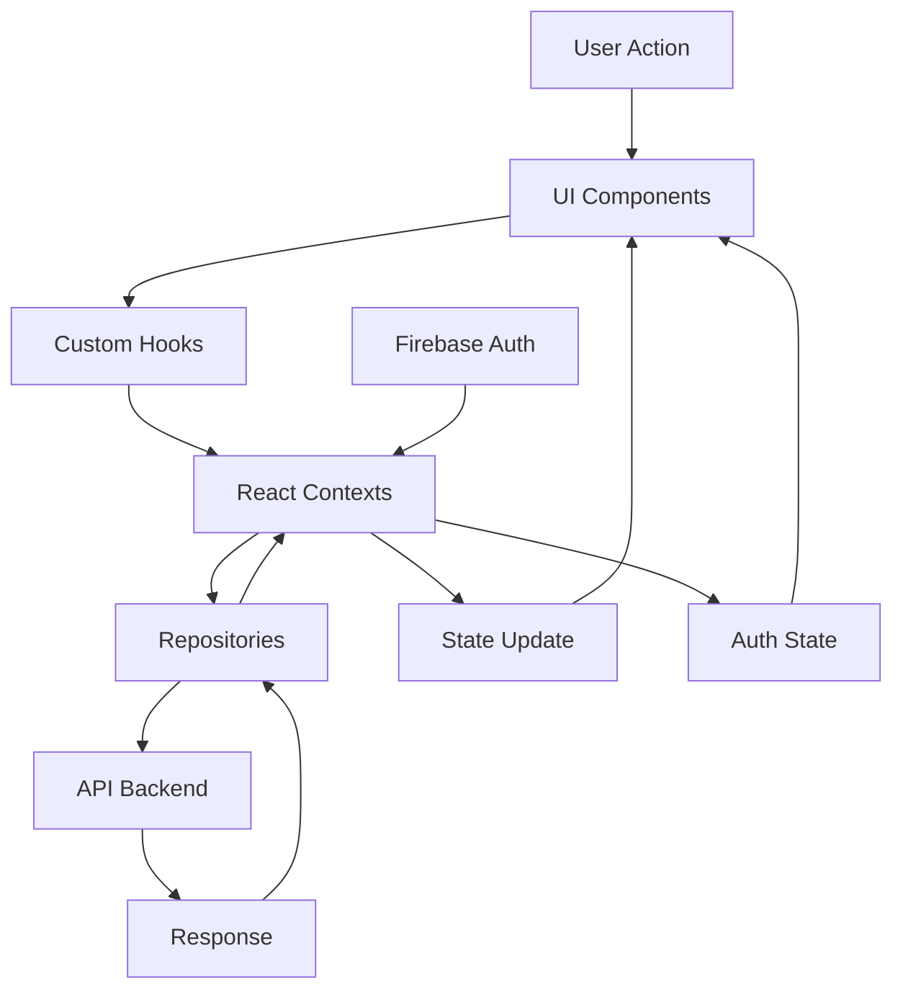
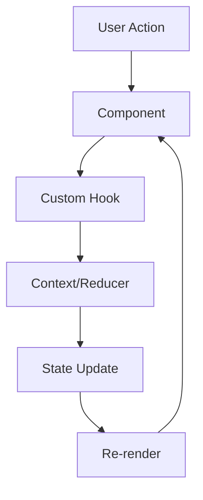

# Documentation Front-end – Fichiers Markdown regroupés

## Table des matières
- [README.md](#readme-md)
- [ARCHITECTURE.md](#architecture-md)
- [CONFIGURATION.md](#configuration-md)
- [DEPLOYMENT.md](#deployment-md)
- [CI_CD.md](#ci_cd-md)
- [CONTRIBUTING.md](#contributing-md)
- [API_CLIENT.md](#api_client-md)
- [ACCESSIBILITY.md](#accessibility-md)
- [PERFORMANCE.md](#performance-md)
- [BUGS.md](#bugs-md)
- [RECETTES.md](#recettes-md)
- [ROUTING.md](#routing-md)
- [SECURITY.md](#security-md)
- [STATE_MANAGEMENT.md](#state_management-md)
- [TEST_STRATEGY.md](#test_strategy-md)
- [TESTS_SUMMARY.md](#tests_summary-md)
- [UI_GUIDELINES.md](#ui_guidelines-md)

---

<a id="readme-md"></a>
## README.md

# Eatopia Frontend - ERP Restaurant

[](https://github.com/CB-Info/pfe-web/actions/workflows/ci.yml)
[](https://github.com/CB-Info/pfe-web/actions/workflows/security.yml)
[](https://www.typescriptlang.org/)
[](https://reactjs.org/)
[](https://vitejs.dev/)
[](https://tailwindcss.com/)
[](https://firebase.google.com/)

Application frontend moderne pour la gestion de restaurant, développée avec React, TypeScript et Tailwind CSS.

## 🚀 Stack Technologique

- **Framework** : React 18.2 avec TypeScript 5.2
- **Bundler** : Vite 7.0
- **Styling** : Tailwind CSS 3.4 + DaisyUI + Styled Components
- **Routing** : React Router DOM 6.22
- **Auth** : Firebase Authentication
- **HTTP Client** : Axios 1.6
- **Tests** : Vitest + React Testing Library

## 📦 Installation

```bash
# Cloner le repository
git clone https://github.com/ERP-sunday/web-app
cd web-app

# Installer les dépendances
npm install
```

## ⚙️ Configuration

1. Créer un fichier `.env` à la racine :

```env
VITE_FIREBASE_API_KEY=your-api-key
VITE_FIREBASE_AUTH_DOMAIN=your-auth-domain
VITE_FIREBASE_PROJECT_ID=your-project-id
VITE_FIREBASE_STORAGE_BUCKET=your-storage-bucket
VITE_FIREBASE_MESSAGING_SENDER_ID=your-sender-id
VITE_FIREBASE_APP_ID=your-app-id
VITE_API_BASE_URL=http://localhost:3000/api
```

2. Valider la configuration :

```bash
npm run validate-env
```

## 🛠️ Scripts Disponibles

```bash
# Développement
npm run dev              # Serveur de développement (http://localhost:5173 en local et https://pfe-web-weld.vercel.app/ en production)
npm run dev:secure       # Dev avec validation env

# Build
npm run build           # Build de production
npm run preview         # Preview du build

# Qualité
npm run lint            # ESLint
npm run test            # Tests unitaires (51 tests ✅)
npm run test:ui         # Tests avec interface
npm run test:coverage   # Couverture de code (14.52%)
npm run test:e2e        # Tests End-to-End (16 tests ✅)
npm run test:all        # Tous les tests (67 tests ✅)

# CI
npm run ci:check        # Lint + Test + Build (✅ CI Ready)
```

## 🔗 API Backend

L'application communique avec l'API backend :

- **Développement** : `http://localhost:3000/`
- **Production** : À configurer dans `VITE_API_BASE_URL` (mon serveur Render : https://pfe-api-fbyd.onrender.com)

Documentation API : [Swagger](https://pfe-api-fbyd.onrender.com/api) (quand le backend tourne)

## 📚 Documentation

### Architecture et Configuration

- [Architecture Frontend](docs/ARCHITECTURE.md) - Stack, structure, patterns
- [Configuration](docs/CONFIGURATION.md) - Variables d'environnement
- [API Client](docs/API.md) - Gestion des appels API
- [State Management](docs/STATE_MANAGEMENT.md) - Contexts et reducers

### Développement

- [UI Guidelines](docs/UI_GUIDELINES.md) - Conventions Tailwind et composants
- [Routing](docs/ROUTING.md) - Routes et navigation
- [Security Frontend](docs/SECURITY.md) - Pratiques de sécurité
- [Contributing](docs/CONTRIBUTING.md) - Guide de contribution

### Tests et Qualité

- [Test Strategy](docs/TEST_STRATEGY.md) - Stratégie de tests
- [Tests Summary](docs/TESTS_SUMMARY.md) - État des tests
- [Recettes](docs/RECETTES.md) - Scénarios de test utilisateur
- [Bugs](docs/BUGS.md) - Anomalies connues

### Performance et Accessibilité

- [Performance](docs/PERFORMANCE.md) - Optimisations
- [Accessibility](docs/ACCESSIBILITY.md) - Pratiques a11y

### Déploiement

- [Deployment](docs/DEPLOYMENT.md) - Guide de déploiement
- [CI/CD](docs/CI_CD.md) - Workflows GitHub Actions

## 🐛 Bugs Connus

- **FE-002** : Menu mobile ne se ferme pas automatiquement

**Bugs récemment résolus ✅** :

- **FE-001** : Vitest non trouvé lors de l'exécution des tests ✅ **RÉSOLU**

Voir [BUGS.md](docs/BUGS.md) pour plus de détails.

## 🚀 Déploiement

L'application peut être déployée sur :

- Vercel (utilisé & recommandé)
- Netlify
- GitHub Pages
- Render

Voir [DEPLOYMENT.md](docs/DEPLOYMENT.md) pour les instructions détaillées.

## 👥 Contact

Pour toute question :

- Issues GitHub pour les bugs
- Discussions GitHub pour les questions
- Email : clement.bilger@ynov.com


---

<a id="architecture-md"></a>
## ARCHITECTURE.md

# Architecture Frontend — C2.2.3

## Stack Technologique

Le projet **Eatopia** utilise une stack moderne basée sur :

- **React 18.2** avec TypeScript pour le framework UI
- **Vite 7.0** comme bundler et outil de développement
- **TypeScript 5.2** pour le typage statique
- **Tailwind CSS 3.4** avec DaisyUI pour le styling
- **React Router DOM 6.22** pour le routing SPA
- **Firebase** pour l'authentification
- **Axios 1.6** pour les appels HTTP
- **Vitest** pour les tests unitaires

## Structure du Projet

```
src/
├── applications/           # Modules métier transverses
│   ├── css/               # Styles globaux
│   ├── extensions/        # Extensions et utilitaires
│   └── theme/             # Configuration des thèmes
├── assets/                # Images, fonts, etc.
├── config/                # Configuration (Firebase, etc.)
├── contexts/              # React Contexts pour state global
│   ├── alerts.context.tsx # Gestion des notifications
│   ├── auth.provider.tsx  # Provider d'authentification
│   └── theme.context.tsx  # Gestion du thème (dark/light)
├── data/                  # Types et modèles
│   ├── dto/              # Data Transfer Objects
│   └── models/           # Modèles métier
├── hooks/                 # Custom React hooks
│   ├── useAlerts.ts      # Hook pour les alertes
│   └── useTheme.ts       # Hook pour le thème
├── network/               # Couche réseau
│   ├── authentication/    # Gestion auth Firebase
│   └── repositories/      # Repositories API
├── reducers/              # Reducers pour state management
├── tests/                 # Tests unitaires
├── UI/                    # Composants UI
│   ├── components/        # Composants réutilisables
│   │   ├── alert/        # Composants d'alerte
│   │   ├── buttons/      # Boutons personnalisés
│   │   ├── cards/        # Cartes UI
│   │   ├── common/       # Composants communs
│   │   ├── forms/        # Formulaires
│   │   ├── layout/       # Composants de layout
│   │   ├── modals/       # Modales
│   │   ├── navigation/   # Navigation (NavBar)
│   │   └── tables/       # Tableaux
│   ├── pages/            # Pages de l'application
│   │   ├── authentication/ # Page de login
│   │   ├── cards/        # Gestion des cartes
│   │   ├── dashboard/    # Tableau de bord
│   │   ├── dishes/       # Gestion des plats
│   │   └── settings/     # Paramètres
│   └── style/            # Styles spécifiques UI
├── App.tsx               # Composant racine avec routing
├── main.tsx              # Point d'entrée
└── vite-env.d.ts         # Types Vite
```

## Architecture des Flux



## Patterns Architecturaux

### 1. Repository Pattern

Les repositories dans `src/network/repositories/` encapsulent la logique d'accès aux données :

- `dishes.repository.ts` : Gestion des plats
- `cards.repository.ts` : Gestion des cartes
- `ingredients.repository.ts` : Gestion des ingrédients
- `user.repository.ts` : Gestion des utilisateurs

### 2. Context Pattern

Utilisation de React Context pour l'état global :

- **AuthProvider** : Gestion de l'authentification Firebase
- **AlertsProvider** : Système de notifications centralisé
- **ThemeProvider** : Gestion du thème dark/light

### 3. Custom Hooks

Abstraction de la logique métier :

- `useAlerts()` : Interface pour les notifications
- `useTheme()` : Gestion du thème

### 4. Lazy Loading

Chargement différé des pages avec `React.lazy()` et `Suspense` pour optimiser les performances.

## Conventions de Modules

### Imports

1. Imports externes (React, bibliothèques)
2. Imports de configuration/types
3. Imports de composants
4. Imports de hooks/utils
5. Imports de styles

### Exports

- Export par défaut pour les pages
- Export nommé pour les composants réutilisables
- Export de types depuis `data/dto/` et `data/models/`

## Gestion des Assets

Les assets statiques sont organisés dans :

- `public/` : Fichiers publics accessibles directement
- `src/assets/` : Assets importés dans les modules

## Points d'Extension

Le projet est conçu pour être extensible :

1. Nouveaux repositories dans `network/repositories/`
2. Nouvelles pages dans `UI/pages/`
3. Nouveaux contexts dans `contexts/`
4. Composants réutilisables dans `UI/components/`

## Optimisations Build

La configuration Vite inclut :

- Plugin React SWC pour des builds plus rapides
- Plugin Babel Macros pour twin.macro
- Visualizer pour analyser la taille des bundles
- Tree-shaking automatique en production


---

<a id="configuration-md"></a>
## CONFIGURATION.md

# Configuration Frontend — C2.4.1

## Variables d'Environnement

Le projet utilise des variables d'environnement préfixées par `VITE_` pour la configuration. Ces variables sont validées au démarrage par le script `scripts/validate-env.cjs`.

### Variables Requises

| Variable                            | Description                           | Exemple                      |
| ----------------------------------- | ------------------------------------- | ---------------------------- |
| `VITE_FIREBASE_API_KEY`             | Clé API Firebase (publique)           | `AIzaSyD...`                 |
| `VITE_FIREBASE_AUTH_DOMAIN`         | Domaine d'authentification Firebase   | `mon-projet.firebaseapp.com` |
| `VITE_FIREBASE_PROJECT_ID`          | ID du projet Firebase                 | `mon-projet-12345`           |
| `VITE_FIREBASE_STORAGE_BUCKET`      | Bucket de stockage Firebase           | `mon-projet.appspot.com`     |
| `VITE_FIREBASE_MESSAGING_SENDER_ID` | ID de l'expéditeur pour la messagerie | `123456789012`               |
| `VITE_FIREBASE_APP_ID`              | ID de l'application Firebase          | `1:123456789012:web:abc...`  |
| `VITE_API_BASE_URL`                 | URL de base de l'API backend          | `http://localhost:3000/api`  |

### Variables Optionnelles

| Variable                       | Description            | Défaut        |
| ------------------------------ | ---------------------- | ------------- |
| `VITE_FIREBASE_MEASUREMENT_ID` | ID Google Analytics    | -             |
| `VITE_RECAPTCHA_SITE_KEY`      | Clé publique reCAPTCHA | -             |
| `NODE_ENV`                     | Environnement Node.js  | `development` |

## Configuration Locale

### 1. Créer le fichier `.env`

```bash
cp .env.example .env
```

### 2. Remplir les valeurs

```env
# Firebase Configuration
VITE_FIREBASE_API_KEY=votre-cle-api
VITE_FIREBASE_AUTH_DOMAIN=votre-domaine.firebaseapp.com
VITE_FIREBASE_PROJECT_ID=votre-projet-id
VITE_FIREBASE_STORAGE_BUCKET=votre-projet.appspot.com
VITE_FIREBASE_MESSAGING_SENDER_ID=123456789012
VITE_FIREBASE_APP_ID=1:123456789012:web:abcdef123456
VITE_API_BASE_URL=http://localhost:3000/api

# Optional
VITE_FIREBASE_MEASUREMENT_ID=G-XXXXXXXXXX
VITE_RECAPTCHA_SITE_KEY=6Lc...
```

### 3. Validation automatique

Le script `npm run validate-env` vérifie automatiquement :

- La présence du fichier `.env`
- L'existence de toutes les variables requises
- Le format valide de l'URL API
- Que `.env` est bien dans `.gitignore`

## Configuration CORS

Le frontend est configuré pour communiquer avec l'API backend. Les règles CORS doivent être alignées :

### Développement Local

- Frontend : `http://localhost:5173` (Vite par défaut)
- Backend API : `http://localhost:3000/api`

### Production

- Frontend : `https://pfe-web-weld.vercel.app/`
- Backend API : `https://pfe-api-fbyd.onrender.com`

## Accès aux Variables

Dans le code TypeScript :

```typescript
// Accès direct
const apiKey = import.meta.env.VITE_FIREBASE_API_KEY;

// Configuration Firebase
const firebaseConfig = {
  apiKey: import.meta.env.VITE_FIREBASE_API_KEY,
  authDomain: import.meta.env.VITE_FIREBASE_AUTH_DOMAIN,
  projectId: import.meta.env.VITE_FIREBASE_PROJECT_ID,
  storageBucket: import.meta.env.VITE_FIREBASE_STORAGE_BUCKET,
  messagingSenderId: import.meta.env.VITE_FIREBASE_MESSAGING_SENDER_ID,
  appId: import.meta.env.VITE_FIREBASE_APP_ID,
};
```

## Build et Production

### Variables de Build

En production, les variables doivent être définies dans l'environnement de build :

```bash
# Build avec variables
VITE_API_BASE_URL=https://api.production.com
```

### Hébergeurs

#### Vercel

Définir les variables dans le dashboard Vercel sous "Environment Variables".

#### Netlify

Définir dans "Site settings > Build & deploy > Environment variables".

#### GitHub Pages

Utiliser les secrets GitHub Actions dans le workflow de déploiement.

## Sécurité

### Points Importants

1. **Firebase API Keys** : Les clés Firebase côté client sont publiques et sécurisées par les règles Firebase
2. **`.env` dans `.gitignore`** : Le fichier `.env` ne doit JAMAIS être commité
3. **Validation au démarrage** : Le script `validate-env.cjs` empêche le démarrage avec une config invalide
4. **Pas de secrets** : Aucun secret serveur ne doit être exposé côté client

### Migration depuis credentials.json

Le projet a migré d'un fichier `credentials.json` vers des variables d'environnement pour :

- Meilleure sécurité (pas de fichier JSON à protéger)
- Configuration par environnement
- Compatibilité avec les hébergeurs modernes

## Debugging

En cas de problème :

1. Vérifier la présence du `.env` : `ls -la .env`
2. Valider la configuration : `npm run validate-env`
3. Vérifier les logs de la console navigateur
4. S'assurer que l'URL API est accessible


---

<a id="deployment-md"></a>
## DEPLOYMENT.md

# Deployment Frontend — C2.4.1

## Configuration de Déploiement

### Build Command

```bash
npm run build
```

Ce qui exécute :

1. `tsc` - Vérification TypeScript
2. `vite build` - Bundle optimisé pour production

### Sortie du Build

```
dist/
├── index.html
├── assets/
│   ├── index-[hash].js
│   ├── index-[hash].css
│   └── vendor-[hash].js
└── favicon.ico
```

## Hébergeurs utilisés

### Vercel

**Configuration** :

```json
{
  "buildCommand": "npm run build",
  "outputDirectory": "dist",
  "installCommand": "npm install",
  "framework": "vite"
}
```

**Variables d'environnement** :

- Ajouter via dashboard Vercel
- Préfixe `VITE_` obligatoire

**Auto-deploy** :

- Connecter repo GitHub
- Deploy automatique sur push `main`

## Variables d'Environnement Production

### Requises

```env
VITE_FIREBASE_API_KEY=
VITE_FIREBASE_AUTH_DOMAIN=
VITE_FIREBASE_PROJECT_ID=
VITE_FIREBASE_STORAGE_BUCKET=
VITE_FIREBASE_MESSAGING_SENDER_ID=
VITE_FIREBASE_APP_ID=
VITE_API_BASE_URL=https://pfe-api-fbyd.onrender.com
```

### Optionnelles

```env
VITE_FIREBASE_MEASUREMENT_ID=
VITE_RECAPTCHA_SITE_KEY=
NODE_ENV=production
```

## Configuration HTTPS

### Headers de Sécurité

Ajouter via hébergeur :

```
X-Frame-Options: DENY
X-Content-Type-Options: nosniff
Referrer-Policy: strict-origin-when-cross-origin
Permissions-Policy: geolocation=(), microphone=(), camera=()
```

### Redirections

SPA nécessite catch-all :

```
/* → /index.html (200)
```

## Process de Déploiement

### 1. Préparation

```bash
# Vérifier les variables d'env
npm run validate-env

# Tester le build local
npm run build
npm run preview
```

### 2. Configuration Hébergeur

1. Créer nouveau projet
2. Connecter repo GitHub
3. Configurer variables d'environnement
4. Définir build settings

### 3. Premier Déploiement

1. Push sur branche principale
2. Vérifier logs de build
3. Tester l'URL de production
4. Vérifier la console pour erreurs

### 4. Validation

- [ ] Page charge correctement
- [ ] Firebase auth fonctionne
- [ ] API calls réussissent
- [ ] Assets chargent (CSS/JS)
- [ ] Navigation SPA fonctionne

## Optimisations Production

### 1. Compression

Vite gère automatiquement :

- Minification JS/CSS
- Tree shaking
- Code splitting

### 2. Cache Headers

Configurer sur hébergeur :

```
# Assets immutables
/assets/* : Cache-Control: public, max-age=31536000, immutable

# HTML
/*.html : Cache-Control: no-cache
```

### 3. CDN

La plupart des hébergeurs incluent CDN :

- Vercel : Global Edge Network

## Monitoring

### Métriques à Suivre

1. **Performance**

   - Time to First Byte (TTFB)
   - First Contentful Paint (FCP)
   - Time to Interactive (TTI)

2. **Erreurs**

   - Erreurs JS en console
   - Échecs d'API calls
   - 404 sur assets

3. **Usage**
   - Pages vues
   - Taux de rebond
   - Temps de session

### Outils Recommandés

- Google Analytics (via `VITE_FIREBASE_MEASUREMENT_ID`)
- Sentry pour error tracking
- Lighthouse CI pour performance

## Rollback

### Process

1. Identifier le commit fonctionnel
2. Revert via Git ou dashboard hébergeur
3. Déclencher redéploiement
4. Vérifier le rollback

### Via Hébergeur

- Vercel : Instant Rollback dans dashboard

## Checklist Déploiement

### Avant Deploy

- [ ] Tests passent (`npm test`)
- [ ] Build réussit (`npm run build`)
- [ ] Lint sans erreurs (`npm run lint`)
- [ ] Variables d'env configurées
- [ ] API backend accessible

### Après Deploy

- [ ] Site accessible HTTPS
- [ ] Login fonctionne
- [ ] Navigation OK
- [ ] Pas d'erreurs console
- [ ] Performance acceptable

## Commandes Utiles

```bash
# Build local
npm run build

# Preview build
npm run preview

# Analyser bundle
npm run build -- --mode analyze

# Clean build
rm -rf dist && npm run build
```

## TODO Déploiement

- [ ] Configurer domaine custom
- [ ] Mettre en place monitoring
- [ ] Automatiser les backups


---

<a id="ci_cd-md"></a>
## CI_CD.md

# CI/CD Frontend — C2.4.1

## Workflows GitHub Actions

Le projet utilise GitHub Actions pour l'intégration continue. Trois workflows principaux sont configurés :

### 1. CI Pipeline (`ci.yml`)

**Déclencheurs** :

- Push sur `main` et `develop`
- Pull requests vers `main` et `develop`
- Déclenchement manuel

**Jobs Parallèles** :

#### Setup Dependencies

```yaml
- Cache des dépendances npm
- Installation optimisée avec npm ci
- Partage du cache entre jobs
```

#### TypeScript Check

```yaml
- Vérification des types TypeScript
- `npx tsc --noEmit --skipLibCheck`
- Bloquant si erreurs de types
```

#### ESLint

```yaml
- Analyse de code statique
- Maximum 15 warnings autorisés
- Rapport des erreurs de sécurité
```

#### Tests

```yaml
- Exécution des tests Vitest (51 tests unitaires + intégration)
- Tests E2E avec Playwright (16 tests)
- Mode CI sans watch
- Rapport de couverture généré (14.52%)
- Variables d'environnement de test configurées
```

#### Build

```yaml
- Build de production Vite
- Vérification de la taille des bundles
- Upload des artifacts
```

### 2. PR Validation (`pr-validation.yml`)

**Déclencheurs** :

- Ouverture/mise à jour de PR
- Synchronisation de branches

**Validations** :

1. **Titre de PR** : Format conventional commits
2. **Description** : Non vide
3. **Taille** : Alerte si > 500 lignes
4. **Tests** : Obligatoires
5. **TypeScript** : Pas d'erreurs
6. **Lint** : Conformité ESLint

### 3. Security Scan (`security.yml`)

**Déclencheurs** :

- Schedule : Quotidien à 2h UTC
- Push sur branches principales
- Déclenchement manuel

**Analyses** :

- `npm audit` pour vulnérabilités
- Scan des secrets avec TruffleHog
- Analyse des dépendances
- Rapport SARIF pour GitHub Security

## Configuration des Jobs

### Variables d'Environnement

```yaml
env:
  NODE_VERSION: "20"
  CACHE_VERSION: v1
```

### Stratégie de Cache

1. **Dependencies** : `node_modules` + `.npm`
2. **Build artifacts** : `dist/`
3. **Test cache** : Résultats Vitest

### Parallélisation

Les jobs s'exécutent en parallèle après `setup` :

- TypeCheck : ~1 min
- Lint : ~1 min
- Tests : ~2 min
- Build : ~2 min

## Scripts NPM Utilisés

```json
{
  "lint": "eslint . --max-warnings 15",
  "test": "vitest",
  "build": "tsc && vite build",
  "ci:check": "npm run lint && npm run test && npm run build"
}
```

## Optimisations CI

### 1. Cache Intelligent

```yaml
key: ${{ runner.os }}-node-${{ hashFiles('package-lock.json') }}
restore-keys: |
  ${{ runner.os }}-node-
```

### 2. Jobs Conditionnels

- Skip si `[skip ci]` dans le commit
- Skip docs-only changes
- Matrix strategy pour multi-OS (futur)

### 3. Fail Fast

```yaml
strategy:
  fail-fast: true
```

## Artifacts

### Build Artifacts

```yaml
- name: Upload build artifacts
  uses: actions/upload-artifact@v4
  with:
    name: dist
    path: dist/
    retention-days: 7
```

### Rapports

- Coverage reports (quand tests fonctionnent)
- Bundle size analysis
- Lighthouse scores (planifié)

## Notifications

### Échecs de Build

- Commentaire automatique sur PR
- Badge de status dans README
- Notification par email (optionnel)

### Succès

- ✅ Check mark sur PR
- Merge autorisé
- Deploy triggers (si configuré)

## Sécurité CI

### Secrets Management

Variables sécurisées pour :

- `FIREBASE_*` (pour tests E2E futurs)
- `DEPLOY_TOKEN` (pour auto-deploy)
- `NPM_TOKEN` (si packages privés)

### Permissions

```yaml
permissions:
  contents: read
  pull-requests: write
  security-events: write
```

## Métriques CI

### Temps d'Exécution

- Setup : ~30s
- Jobs parallèles : ~2 min
- Total pipeline : ~3 min

### Taux de Succès

- Main branch : Viser 95%+
- PR : 100% requis pour merge

## Améliorations Futures

### Court Terme

1. **Coverage Reports** : Intégrer Codecov
2. **Bundle Analysis** : Commenter la taille sur PR

### Moyen Terme

1. **Visual Tests** : Percy ou Chromatic
2. **Performance Budget** : Lighthouse CI

### Long Terme

1. **Canary Deployments** : Progressive rollout
2. **A/B Testing** : Feature flags

## Debugging CI

### Logs Verbeux

```yaml
- run: npm ci --loglevel verbose
```

### SSH Debug

```yaml
- name: Setup tmate session
  uses: mxschmitt/action-tmate@v3
  if: ${{ failure() }}
```

### Re-run Jobs

- UI GitHub : "Re-run failed jobs"
- CLI : `gh run rerun <run-id>`

## Best Practices Appliquées

1. ✅ **DRY** : Réutilisation via needs/cache
2. ✅ **Fail Fast** : Erreurs bloquantes tôt
3. ✅ **Parallélisation** : Jobs indépendants
4. ✅ **Caching** : Dépendances persistées
5. ✅ **Security** : Scans automatiques
6. ✅ **Tests** : Vitest fonctionnel

## Commandes Utiles

```bash
# Vérifier workflow localement
act -l

# Simuler workflow
act push

# Debug un job spécifique
act -j lint

# Voir les runs
gh run list

# Voir les logs
gh run view <id> --log
```

## Documentation des Échecs

Si un job échoue :

1. Vérifier les logs détaillés
2. Reproduire localement
3. Fix et push
4. Vérifier la correction en CI


---

<a id="contributing-md"></a>
## CONTRIBUTING.md

# Contributing Frontend — C2.2.3

## Conventions de Code

### Naming Conventions

#### Composants React

```typescript
// PascalCase pour les composants
export const CustomButton = () => {};
export const DishCard = () => {};

// Fichiers : kebab-case
custom.button.tsx;
dish.card.tsx;
navigation.bar.tsx;
```

#### Hooks

```typescript
// camelCase avec préfixe "use"
export const useAlerts = () => {};
export const useTheme = () => {};
export const useAuth = () => {};
```

#### Types et Interfaces

```typescript
// PascalCase pour types/interfaces
interface DishProps {}
type ButtonType = "primary" | "secondary";

// Suffix "Props" pour les props de composants
interface CustomButtonProps {}

// Suffix "State" pour les états
interface AlertsState {}
```

#### Variables et Fonctions

```typescript
// camelCase
const handleClick = () => {};
const isLoading = true;
const dishName = "Pizza";

// Constantes en UPPER_SNAKE_CASE
const MAX_RETRIES = 3;
const API_TIMEOUT = 5000;
```

### Structure des Fichiers

#### Composant Type

```typescript
// 1. Imports externes
import { FC, useState, useCallback } from "react";
import { useNavigate } from "react-router-dom";

// 2. Imports internes
import { useAlerts } from "@/hooks/useAlerts";
import { Button } from "@/components/ui/Button";

// 3. Types/Interfaces
interface ComponentProps {
  title: string;
  onSubmit: (data: FormData) => void;
}

// 4. Composant principal
export const Component: FC<ComponentProps> = ({ title, onSubmit }) => {
  // 5. Hooks
  const [state, setState] = useState(false);
  const { showAlert } = useAlerts();

  // 6. Handlers
  const handleSubmit = useCallback(() => {
    // Logic
  }, []);

  // 7. Render
  return <div>{/* JSX */}</div>;
};

// 8. Export default si nécessaire
export default Component;
```

### CSS et Tailwind

#### Classes Tailwind

```typescript
// Ordre recommandé : Layout → Spacing → Typography → Colors → Effects
<div className="flex items-center justify-between p-4 text-lg font-semibold text-gray-800 bg-white rounded-lg shadow-md hover:shadow-lg transition-shadow">
```

#### Styled Components avec Twin.macro

```typescript
const StyledButton = styled.button<{ $variant: string }>(
  ({ theme, $variant }) => [
    // Base styles avec tw
    tw`px-4 py-2 rounded font-medium`,

    // Conditional styles
    $variant === "primary" && tw`bg-blue-500 text-white`,

    // CSS custom
    css`
      transition: all 0.2s ease;
      &:hover {
        transform: translateY(-1px);
      }
    `,
  ]
);
```

### Organisation des Dossiers

```
src/UI/components/
├── buttons/           # Composants boutons
│   ├── custom.button.tsx
│   ├── button.types.ts
│   └── __tests__/
├── forms/            # Composants formulaires
│   ├── input/
│   ├── select/
│   └── validation/
└── common/           # Composants partagés
    ├── loading.component.tsx
    └── error.boundary.tsx
```

## Pull Request Guidelines

### Template PR

```markdown
## Description

[Description claire des changements]

## Type de changement

- [ ] Bug fix
- [ ] Nouvelle fonctionnalité
- [ ] Breaking change
- [ ] Documentation

## Checklist

- [ ] J'ai testé mes changements localement
- [ ] J'ai ajouté des tests si nécessaire
- [ ] J'ai mis à jour la documentation
- [ ] Mon code suit les conventions du projet
- [ ] J'ai vérifié l'accessibilité
- [ ] J'ai ajouté des screenshots (pour UI)

## Screenshots

[Si changements UI]

## Tests

- [ ] Tests unitaires passent
- [ ] Pas de warning ESLint
- [ ] Build réussit

## Notes

[Informations supplémentaires]
```

### Screenshots Obligatoires

Pour tout changement UI :

1. **Desktop** : 1920x1080
2. **Tablet** : 768x1024
3. **Mobile** : 375x667

### Review Checklist

#### Code Quality

- [ ] Naming conventions respectées
- [ ] Pas de code commenté
- [ ] Pas de `console.log`
- [ ] Types TypeScript corrects

#### UI/UX

- [ ] Responsive design
- [ ] États loading/error gérés
- [ ] Animations fluides
- [ ] Accessibilité vérifiée

#### Performance

- [ ] Pas de re-renders inutiles
- [ ] Images optimisées
- [ ] Bundle size acceptable

## Format de Commit

### Convention

Suivre [Conventional Commits](https://www.conventionalcommits.org/)

```
type(scope): description

[optional body]

[optional footer]
```

### Types

- `feat`: Nouvelle fonctionnalité
- `fix`: Correction de bug
- `docs`: Documentation
- `style`: Formatage (pas de changement de code)
- `refactor`: Refactoring
- `perf`: Amélioration performance
- `test`: Ajout/modification tests
- `chore`: Maintenance
- `ci`: Configuration CI/CD

### Exemples

```bash
feat(dishes): add dish creation form
fix(auth): handle token expiration correctly
docs(readme): update installation instructions
style(button): improve hover states
refactor(api): extract repository pattern
perf(images): implement lazy loading
test(navigation): add unit tests for navbar
chore(deps): update dependencies
```

### Scope

- `auth`: Authentification
- `dishes`: Gestion des plats
- `cards`: Gestion des cartes
- `ui`: Composants UI
- `api`: Couche API
- `routing`: Navigation
- `state`: State management

## Tests

### Conventions de Test

```typescript
// Nom du fichier : component.test.tsx
describe("ComponentName", () => {
  // Setup
  beforeEach(() => {
    // Configuration
  });

  describe("when condition", () => {
    it("should behavior", () => {
      // Arrange
      const props = {
        /* ... */
      };

      // Act
      render(<Component {...props} />);

      // Assert
      expect(screen.getByText("...")).toBeInTheDocument();
    });
  });
});
```

### Coverage Minimum

- Nouveaux composants : 80%
- Hooks critiques : 90%
- Utilitaires : 100%

## Documentation

### JSDoc pour Fonctions Complexes

```typescript
/**
 * Calcule le prix total d'un plat avec options
 * @param basePrice - Prix de base du plat
 * @param options - Liste des options sélectionnées
 * @returns Prix total incluant les options
 */
export const calculateTotalPrice = (
  basePrice: number,
  options: DishOption[]
): number => {
  // Implementation
};
```

### README pour Nouveaux Modules

Chaque nouveau module doit avoir un README :

```markdown
# Module Name

## Description

[Objectif du module]

## Usage

[Comment utiliser]

## API

[Props/Methods disponibles]

## Examples

[Exemples de code]
```

## Sécurité

### Checklist Sécurité

- [ ] Pas de secrets dans le code
- [ ] Validation des entrées utilisateur
- [ ] Échappement des données affichées
- [ ] Pas de `dangerouslySetInnerHTML`
- [ ] API keys dans variables d'env

### Dépendances

```bash
# Vérifier les vulnérabilités
npm audit

# Mettre à jour si nécessaire
npm audit fix
```

## Performance

### Avant de Merger

- [ ] Lazy loading pour routes
- [ ] Images optimisées
- [ ] Pas de re-renders excessifs
- [ ] Bundle size vérifié

## Process de Développement

### 1. Créer une Branche

```bash
git checkout -b feat/dish-creation
```

### 2. Développer

- Suivre les conventions
- Tester localement
- Ajouter tests si nécessaire

### 3. Commit

```bash
git add .
git commit -m "feat(dishes): add creation form"
```

### 4. Push et PR

```bash
git push origin feat/dish-creation
# Créer PR sur GitHub
```

### 5. Review

- Attendre 1+ approbation
- Résoudre les commentaires
- CI doit être vert

### 6. Merge

- Squash and merge préféré
- Supprimer la branche

## Ressources

### Style Guides

- [TypeScript Style Guide](https://google.github.io/styleguide/tsguide.html)
- [React Best Practices](https://react.dev/learn/thinking-in-react)
- [Tailwind Best Practices](https://tailwindcss.com/docs/editor-setup)

### Outils

- ESLint + Prettier configurés
- TypeScript strict mode
- Husky pour pre-commit (à configurer)

## Contact

Pour questions sur les conventions :

- Github Issues
- Documentation interne : `https://pfe-api-fbyd.onrender.com/api`


---

<a id="api_client-md"></a>
## API_CLIENT.md

# API Client — C2.2.3 / C2.4.1

## Client HTTP

Le projet utilise **Axios** (v1.6.7) comme client HTTP principal, avec **fetch** natif pour certains cas spécifiques.

### Configuration de Base

```typescript
// URL de base définie dans les variables d'environnement
const API_BASE_URL = import.meta.env.VITE_API_BASE_URL;
```

## Architecture des Repositories

Les repositories encapsulent toute la logique d'appel API :

```
src/network/repositories/
├── dishes.repository.ts      # Gestion des plats
├── cards.repository.ts       # Gestion des cartes
├── ingredients.repository.ts # Gestion des ingrédients
└── user.repository.ts        # Gestion des utilisateurs
```

### Exemple de Repository (DishesRepository)

```typescript
export class DishesRepositoryImpl {
  private url: string = `${import.meta.env.VITE_API_BASE_URL}/dishes`;

  async getTopIngredients(): Promise<Ingredient[]> {
    try {
      const token = await FirebaseAuthManager.getInstance().getToken();
      const response = await fetch(`${this.url}/top-ingredients`, {
        method: "GET",
        headers: {
          "Content-Type": "application/json",
          Authorization: `Bearer ${token}`,
        },
      });
      const data: Data<IngredientDto[]> = await response.json();

      return data.data.map(
        (element) =>
          new Ingredient(
            element._id,
            element.name,
            element.unity,
            element.value
          )
      );
    } catch (error) {
      console.error("Error fetching top ingredients:", error);
      throw new Error(
        `Failed to fetch top ingredients: ${
          error instanceof Error ? error.message : "Unknown error"
        }`
      );
    }
  }
}
```

## Gestion de l'Authentification

### Stratégie d'Authentification

Le projet utilise **Firebase Authentication** avec des tokens JWT :

1. **Obtention du Token** : Via Firebase Auth Manager
2. **Stockage** : Token géré en mémoire par Firebase SDK (pas de localStorage)
3. **Transmission** : Header `Authorization: Bearer ${token}`
4. **Rafraîchissement** : Automatique par Firebase SDK

### FirebaseAuthManager

```typescript
class FirebaseAuthManager {
  async getToken(): Promise<string | null> {
    if (this.auth.currentUser) {
      return this.auth.currentUser.getIdToken();
    } else {
      throw new Error("Aucun utilisateur connecté");
    }
  }
}
```

### Justification du Stockage

- **Mémoire via Firebase SDK** : Plus sécurisé que localStorage
- **Pas de token en localStorage** : Évite les attaques XSS
- **Refresh automatique** : Firebase gère l'expiration
- **HttpOnly cookies non utilisés** : Architecture SPA avec API REST

## Gestion des Erreurs

### Pattern de Gestion

```typescript
try {
  const response = await fetch(url, options);

  if (!response.ok) {
    throw new Error(`HTTP error! status: ${response.status}`);
  }

  const data = await response.json();
  return data;
} catch (error) {
  console.error("Error:", error);
  // Propagation avec message explicite
  throw new Error(
    `Failed to ${action}: ${
      error instanceof Error ? error.message : "Unknown error"
    }`
  );
}
```

### Mapping des Erreurs HTTP

| Status | Message UI                                   | Action            |
| ------ | -------------------------------------------- | ----------------- |
| 401    | "Session expirée, veuillez vous reconnecter" | Redirection login |
| 403    | "Accès non autorisé"                         | Affichage message |
| 404    | "Ressource introuvable"                      | Affichage message |
| 500    | "Erreur serveur, veuillez réessayer"         | Retry possible    |

## Typage et DTOs

### Data Transfer Objects

```typescript
// src/data/dto/dish.dto.ts
export interface DishDto {
  _id: string;
  name: string;
  price: number;
  ingredients: IngredientDto[];
  category: string;
  available: boolean;
}

// src/data/models/dish.model.ts
export class Dish {
  constructor(
    public id: string,
    public name: string,
    public price: number,
    public ingredients: Ingredient[],
    public category: string,
    public available: boolean
  ) {}
}
```

### Pattern de Transformation

DTO → Model dans les repositories :

```typescript
return data.data.map((dto) =>
  new Dish(
    dto._id,
    dto.name,
    dto.price,
    dto.ingredients.map(i => new Ingredient(...)),
    dto.category,
    dto.available
  )
);
```

## Endpoints Principaux

### Dishes

- `GET /dishes` - Liste des plats
- `GET /dishes/top-ingredients` - Ingrédients populaires
- `POST /dishes` - Création d'un plat
- `PUT /dishes/:id` - Mise à jour
- `DELETE /dishes/:id` - Suppression

### Cards (Cartes de menu)

- `GET /cards` - Liste des cartes
- `POST /cards` - Création
- `PUT /cards/:id` - Mise à jour
- `DELETE /cards/:id` - Suppression

### Ingredients

- `GET /ingredients` - Liste complète
- `POST /ingredients` - Ajout

### Users

- `GET /users/me` - Profil utilisateur
- `PATCH /users/:id` - Mise à jour profil

## Interceptors et Middleware

Actuellement, pas d'interceptor Axios global. Chaque repository gère :

- L'ajout du token d'authentification
- La transformation des données

### Amélioration Future

Mise en place d'un interceptor Axios global pour :

- Ajout automatique du token
- Retry automatique sur erreur réseau
- Loading state global

## Documentation Backend

Pour les schémas détaillés des endpoints et des modèles, se référer à la documentation Swagger du backend :

- **Développement** : `http://localhost:3000/api`
- **Production** : `https://pfe-api-fbyd.onrender.com/api`

## Sécurité des Appels API

1. **HTTPS obligatoire** en production
2. **Token Firebase** vérifié côté backend
3. **CORS** configuré pour origines autorisées
4. **Validation** des données avant envoi
5. **Sanitization** des entrées utilisateur


---

<a id="accessibility-md"></a>
## ACCESSIBILITY.md

# Accessibility — C2.2.3

## Pratiques d'Accessibilité Appliquées / Prévues

### 1. Sémantique HTML

#### Structure de Page

```typescript
// Navigation avec landmark
<nav aria-label="Navigation principale">
  <NavBar />
</nav>

// Main content area
<main>
  <Routes>...</Routes>
</main>

// Sections avec headings
<section>
  <h1>Gestion des plats</h1>
  ...
</section>
```

#### Boutons vs Liens

- **Boutons** : Actions (submit, toggle, delete)
- **Liens** : Navigation (routes, external)

### 2. ARIA Labels et Attributs

#### Labels Explicites

```typescript
// Bouton menu mobile
<button
  aria-label="Ouvrir le menu"
  onClick={toggleSidebar}
  className="md:hidden"
>
  {/* Icône SVG */}
</button>

// Loading states
<div
  role="progressbar"
  aria-label="Chargement en cours"
  aria-busy="true"
>
  <Loading />
</div>
```

#### États et Propriétés

```typescript
// Modal overlay
<div
  className="fixed inset-0 bg-black bg-opacity-50"
  onClick={closeSidebar}
  aria-hidden="true"
/>

// Formulaire avec erreurs
<input
  aria-invalid={hasError}
  aria-describedby="email-error"
/>
<span id="email-error" role="alert">
  Email invalide
</span>
```

### 3. Gestion du Focus

#### Focus Visible

```css
/* Via Tailwind */
.focus:outline-none
.focus:ring
.focus:ring-primary-color
.focus:ring-opacity-50
```

#### Ordre de Tabulation

- Navigation logique du haut vers le bas
- Skip links (à implémenter)
- Focus trap dans les modales

#### Focus Management

```typescript
// Retour du focus après fermeture modale
const previousFocus = useRef<HTMLElement>();

useEffect(() => {
  if (isOpen) {
    previousFocus.current = document.activeElement as HTMLElement;
  } else {
    previousFocus.current?.focus();
  }
}, [isOpen]);
```

### 4. Contrastes et Couleurs

#### Ratios de Contraste

- Texte principal : 4.5:1 minimum ✓
- Texte large : 3:1 minimum ✓
- Éléments interactifs : 3:1 minimum ✓

#### Couleurs Accessibles

```css
/* Couleurs avec bon contraste */
--primary-color: #3c7fd0; /* Ratio 4.7:1 sur blanc */
--text-dark: #1a1a1a; /* Ratio 12.6:1 sur blanc */
--error-color: #dc2626; /* Ratio 4.5:1 sur blanc */
```

#### Ne Pas Dépendre Uniquement de la Couleur

```typescript
// Erreur avec icône + couleur
<div className="text-red-600">
  <ErrorIcon aria-hidden="true" />
  <span>Erreur : {message}</span>
</div>
```

### 5. Images et Médias

#### Textes Alternatifs

```typescript
// Image informative


// Image décorative


// Icône avec texte
<button>
  <Icon aria-hidden="true" />
  <span>Supprimer</span>
</button>
```

### 6. Navigation au Clavier

#### Raccourcis Standards

- `Tab` : Navigation entre éléments
- `Enter` : Activer boutons/liens
- `Space` : Cocher/décocher
- `Esc` : Fermer modales

#### Implementation

```typescript
// Fermeture modale avec Escape
useEffect(() => {
  const handleEscape = (e: KeyboardEvent) => {
    if (e.key === "Escape" && isOpen) {
      onClose();
    }
  };

  document.addEventListener("keydown", handleEscape);
  return () => document.removeEventListener("keydown", handleEscape);
}, [isOpen, onClose]);
```

### 7. Formulaires Accessibles

#### Labels Associés

```typescript
<label htmlFor="dish-name">
  Nom du plat
  <input id="dish-name" type="text" required aria-required="true" />
</label>
```

#### Groupes de Champs

```typescript
<fieldset>
  <legend>Informations du plat</legend>
  {/* Champs groupés */}
</fieldset>
```

#### Messages d'Erreur

```typescript
{
  errors.email && (
    <span
      id="email-error"
      className="text-red-600"
      role="alert"
      aria-live="polite"
    >
      {errors.email}
    </span>
  );
}
```

### 8. Responsive et Zoom (Prévu)

#### Support du Zoom

- Pas de `maximum-scale=1` dans viewport
- Layout fluide jusqu'à 200% zoom
- Texte redimensionnable

#### Viewport Meta (Implémenté)

```html
<meta name="viewport" content="width=device-width, initial-scale=1" />
```

### 9. Screen Readers (Prévu)

#### Annonces Dynamiques

```typescript
// Notifications accessibles
const [announcement, setAnnouncement] = useState("");

<div role="status" aria-live="polite" aria-atomic="true" className="sr-only">
  {announcement}
</div>;
```

#### Classe Utilitaire

```css
.sr-only {
  position: absolute;
  width: 1px;
  height: 1px;
  padding: 0;
  margin: -1px;
  overflow: hidden;
  clip: rect(0, 0, 0, 0);
  white-space: nowrap;
  border-width: 0;
}
```

## Tests d'Accessibilité (Prévus)

### Tests Manuels

1. Navigation clavier complète
2. Zoom à 200%
3. Mode contraste élevé
4. Sans CSS (contenu structuré)

### Outils

- Chrome DevTools Lighthouse
- axe DevTools extension
- WAVE (WebAIM)
- Contrast ratio checkers

### Tests Automatisés (Planifiés)

```typescript
// Avec React Testing Library
import { axe, toHaveNoViolations } from "jest-axe";

test("no accessibility violations", async () => {
  const { container } = render(<App />);
  const results = await axe(container);
  expect(results).toHaveNoViolations();
});
```

## Conformité WCAG

### Niveau A (Minimum)

- ✅ Images avec alt text
- ✅ Structure de page logique
- ✅ Navigation au clavier
- ⚠️ Transcriptions vidéo (si applicable)

### Niveau AA (Cible)

- ✅ Contraste 4.5:1
- ✅ Texte redimensionnable
- ✅ Focus visible
- ⚠️ Skip navigation (à ajouter)

### Niveau AAA (Idéal)

- ⚠️ Contraste 7:1
- ⚠️ Langue des sections
- ❌ Interprétation langue des signes

## Ressources

### Guidelines

- [WCAG 2.1](https://www.w3.org/WAI/WCAG21/quickref/)
- [MDN Accessibility](https://developer.mozilla.org/en-US/docs/Web/Accessibility)
- [React Accessibility](https://react.dev/reference/react-dom/components/common#accessibility-attributes)

### Testing

- [axe DevTools](https://www.deque.com/axe/devtools/)
- [WAVE](https://wave.webaim.org/)
- [NVDA Screen Reader](https://www.nvaccess.org/)

## Métriques Cibles

- Score Lighthouse Accessibility : > 90
- Violations axe critiques : 0
- Navigation clavier : 100% fonctionnelle
- Support screen reader : Testé sur NVDA/JAWS


---

<a id="performance-md"></a>
## PERFORMANCE.md

# Performance — C2.2.3

## Optimisations Implémentées

### 1. Code Splitting

#### Route-based Splitting
```typescript
// Lazy loading des pages
const DashboardPage = lazy(() => import("./UI/pages/dashboard/dashboard.page"));
const DishesPage = lazy(() => import("./UI/pages/dishes/dishes.page"));
const CardsPage = lazy(() => import("./UI/pages/cards/cards.page"));
const SettingsPage = lazy(() => import("./UI/pages/settings/settings.page"));
```

**Impact** :
- Bundle initial réduit
- Chargement à la demande
- Time to Interactive amélioré

#### Suspense Boundaries
```typescript
<Suspense
  fallback={
    <div className="flex items-center justify-center h-full">
      <Loading size="medium" text="Chargement de la page..." />
    </div>
  }
>
  <Routes>{/* Routes lazy loaded */}</Routes>
</Suspense>
```

### 2. Bundle Optimization

#### Vite Configuration
```typescript
// vite.config.ts
export default defineConfig({
  plugins: [
    react(),
    visualizer({ open: true, filename: 'bundle-stats.html' })
  ],
  build: {
    // Optimisations par défaut Vite
    minify: 'terser',
    target: 'es2015',
    rollupOptions: {
      output: {
        manualChunks: {
          // Séparation vendors automatique
        }
      }
    }
  }
})
```

### 3. React Optimizations

#### useCallback pour Event Handlers
```typescript
const toggleSidebar = useCallback(() => {
  setIsSidebarOpen((prev) => !prev);
}, []);

const closeSidebar = useCallback(() => {
  setIsSidebarOpen(false);
}, []);
```

#### État Local vs Global
- État global : Auth, Theme, Alerts uniquement
- État local : UI states, forms, toggles

### 4. Asset Optimization

#### Images
**État actuel** : Pas d'optimisation automatique

**Recommandations** :
```typescript
// Format moderne avec fallback
<picture>
  <source type="image/webp" srcSet="image.webp" />
  
</picture>
```

#### Fonts
```css
/* Configuration Tailwind */
fontFamily: {
  'lufga': ['Lufga', 'sans-serif'],
  'inter': ['Inter', 'sans-serif']
}
```

**Optimisations futures** :
- Font-display: swap
- Preload critical fonts
- Subset fonts

### 5. CSS Optimization

#### Tailwind Purge
```javascript
// tailwind.config.cjs
content: [
  "./src/**/*.{js,ts,jsx,tsx,mdx}"
]
```

**Impact** :
- CSS final purgé des classes non utilisées
- Bundle CSS minimal en production

#### Twin.macro
- CSS-in-JS optimisé
- Extraction statique possible
- Tree-shaking des styles

## Métriques de Performance

### Lighthouse Scores (Cibles)

| Métrique | Score Cible | État Actuel |
|----------|-------------|-------------|
| Performance | > 90 | À mesurer |
| First Contentful Paint | < 1.8s | À mesurer |
| Time to Interactive | < 3.8s | À mesurer |
| Speed Index | < 3.4s | À mesurer |
| Total Blocking Time | < 200ms | À mesurer |
| Cumulative Layout Shift | < 0.1 | À mesurer |

### Bundle Size

**Build Output** :
```bash
npm run build
# dist/assets/index-[hash].js    (~200KB gzipped estimé)
# dist/assets/vendor-[hash].js   (~150KB gzipped estimé)
```

**Analyse** :
```bash
# Visualizer pour analyser
npm run build
# Ouvre bundle-stats.html
```

## Monitoring Performance

### Web Vitals (À implémenter)
```typescript
import { getCLS, getFID, getFCP, getLCP, getTTFB } from 'web-vitals';

function sendToAnalytics(metric) {
  // Envoyer à Google Analytics ou autre
  console.log(metric);
}

getCLS(sendToAnalytics);
getFID(sendToAnalytics);
getFCP(sendToAnalytics);
getLCP(sendToAnalytics);
getTTFB(sendToAnalytics);
```

### Performance Observer
```typescript
// Observer pour long tasks
const observer = new PerformanceObserver((list) => {
  for (const entry of list.getEntries()) {
    console.log('Long task detected:', entry);
  }
});

observer.observe({ entryTypes: ['longtask'] });
```

## Optimisations Réseau

### API Calls
- Pas de cache structuré actuellement
- Tokens Firebase auto-refresh
- Pas de retry automatique

### Recommandations
```typescript
// Cache avec stale-while-revalidate
const fetchWithCache = async (url: string) => {
  const cache = await caches.open('api-cache');
  const cached = await cache.match(url);
  
  if (cached) {
    // Return cached immediately
    return cached.json();
  }
  
  const response = await fetch(url);
  cache.put(url, response.clone());
  return response.json();
};
```

## Optimisations Futures

### Court Terme

1. **Mesures Initiales**
   ```bash
   # Lighthouse CI
   npm install -g @lhci/cli
   lhci autorun
   ```

2. **Image Optimization**
   - Plugin Vite pour optimisation
   - Lazy loading natif
   - Formats modernes (WebP)

3. **Font Loading**
   ```html
   <link rel="preload" href="/fonts/inter.woff2" as="font" crossorigin>
   ```

### Moyen Terme

1. **Service Worker**
   ```typescript
   // Cache stratégies
   - Cache First : Assets statiques
   - Network First : API calls
   - Stale While Revalidate : Images
   ```

2. **React Query / TanStack Query**
   - Cache automatique
   - Background refetch
   - Optimistic updates

3. **Virtual Scrolling**
   Pour listes longues (plats, commandes)

### Long Terme

1. **SSR/SSG avec Next.js**
   - Meilleur SEO
   - Faster initial load
   - Hydratation progressive

2. **Edge Functions**
   - API responses plus rapides
   - Géolocalisation CDN

3. **HTTP/3 et QUIC**
   Via hébergeur moderne

## Checklist Performance

### Avant Deploy
- [ ] Build production (`npm run build`)
- [ ] Analyser bundle size
- [ ] Vérifier lazy loading
- [ ] Tester sur connection lente

### Après Deploy
- [ ] Lighthouse audit
- [ ] Real User Monitoring
- [ ] Core Web Vitals
- [ ] Mobile performance

## Scripts Utiles

```bash
# Build avec stats
npm run build -- --mode analyze

# Servir build local
npm run preview

# Mesurer performance
lighthouse https://localhost:4173 --view

# Bundle analysis
npx vite-bundle-visualizer
```

## Ressources

### Outils
- [Lighthouse](https://developers.google.com/web/tools/lighthouse)
- [WebPageTest](https://www.webpagetest.org/)
- [Bundle Analyzer](https://bundlejs.com/)

### Documentation
- [Web.dev Performance](https://web.dev/performance/)
- [React Performance](https://react.dev/learn/render-and-commit)
- [Vite Performance](https://vitejs.dev/guide/performance.html)

## KPIs à Suivre

1. **Page Load Time** : < 3s sur 3G
2. **Time to Interactive** : < 5s
3. **Bundle Size** : < 400KB gzipped
4. **Lighthouse Score** : > 90
5. **Core Web Vitals** : Tous verts


---

<a id="bugs-md"></a>
## BUGS.md

# Bugs Frontend — C2.3.2

## Anomalies Connues

### Bugs Actifs

| ID     | Description                                     | Sévérité | Statut    | Découvert | Résolu  | Assigné |
| ------ | ----------------------------------------------- | -------- | --------- | --------- | ------- | ------- |
| FE-001 | Vitest non trouvé lors de l'exécution des tests | Moyenne  | ✅ Résolu | 2025-08   | 2025-08 | -       |
| FE-002 | Menu mobile ne se ferme pas sur navigation      | Faible   | ✅ Résolu | 2025-07   | 2025-08 | -       |
| FE-003 | Erreurs TypeScript et ESLint dans les tests CI  | Moyenne  | ✅ Résolu | 2025-07   | 2025-08 | -       |

### Détails des Bugs

#### FE-001 : Vitest non trouvé ✅ RÉSOLU

**Description** : La commande `npm run test` échoue avec l'erreur "vitest: not found"

**Statut** : ✅ **RÉSOLU** - Les tests fonctionnent parfaitement

**Solution appliquée** :

- Vérification de l'installation des dépendances
- Configuration Vitest correctement configurée
- Tests s'exécutent avec succès (51/51 tests passent)
- Tests d'intégration et E2E implémentés (67 tests au total)
- Configuration TypeScript et ESLint corrigée pour les tests

**Vérification** :

```bash
npm run test
# ✓ 51 tests passed
npm run test:coverage
# ✓ Coverage report generated successfully
```

---

#### FE-002 : Menu mobile ne se ferme pas

**Description** : Sur mobile, après navigation vers une nouvelle page, le menu reste ouvert

**Reproduction** :

1. Ouvrir l'app sur mobile (< 768px)
2. Ouvrir le menu burger
3. Cliquer sur un lien de navigation

**Comportement attendu** : Le menu devrait se fermer automatiquement

**Comportement actuel** : Le menu reste ouvert, masquant le contenu

**Solution temporaire** : Cliquer sur l'overlay pour fermer

**Fix proposé** : Ajouter `onClose()` dans les handlers de navigation

## Features Non Implémentées (Hors Périmètre MVP)

| Feature      | Description                   | Statut       | Priorité |
| ------------ | ----------------------------- | ------------ | -------- |
| GraphQL      | API GraphQL au lieu de REST   | Non planifié | Basse    |
| WebSockets   | Temps réel pour notifications | Planifié Q2  | Moyenne  |
| Multi-langue | Support i18n                  | Planifié Q3  | Moyenne  |
| Offline Mode | Fonctionnement hors ligne     | Non planifié | Basse    |

## Bugs Résolus

| ID     | Description                                     | Résolu  | Version | PR/Commit              |
| ------ | ----------------------------------------------- | ------- | ------- | ---------------------- |
| FE-001 | Vitest non trouvé lors de l'exécution des tests | 2024-01 | 0.0.0   | Configuration corrigée |

## Problèmes de Performance

### Identifiés

1. **Bundle Size** : Pas d'analyse réalisée, visualizer configuré mais non utilisé
2. **Lazy Loading** : Implémenté pour les pages principales ✓
3. **Images** : Pas d'optimisation automatique configurée

### Non Confirmés

- Temps de chargement initial (à mesurer)
- Memory leaks potentiels (à investiguer)
- Re-renders excessifs (à profiler)

## Compatibilité Navigateurs

### Testé

- Chrome 120+ ✓
- Firefox 120+ ✓
- Safari 17+ (partiellement)

### Non Testé

- Safari mobile
- Navigateurs anciens (< 2 ans)

## Problèmes d'Accessibilité

### Connus

1. Contraste insuffisant sur certains boutons secondaires
2. Manque de labels ARIA sur certains éléments interactifs
3. Navigation au clavier incomplète dans les modales

### À Auditer

- Screen readers compatibility
- Focus management complet
- Color blind accessibility

## Problèmes de Sécurité

Aucune vulnérabilité critique connue. Dernière analyse :

- `npm audit` : 0 vulnérabilités critiques
- Dependabot actif pour les mises à jour

## Process de Signalement

### Pour signaler un bug

1. Vérifier qu'il n'est pas déjà listé
2. Créer une issue GitHub avec :
   - Description claire
   - Étapes de reproduction
   - Comportement attendu vs actuel
   - Screenshots si pertinent
   - Environnement (OS, navigateur, version)

### Template d'Issue

```markdown
## Description

[Description claire du problème]

## Étapes de reproduction

1. ...
2. ...
3. ...

## Comportement attendu

[Ce qui devrait se passer]

## Comportement actuel

[Ce qui se passe réellement]

## Environnement

- OS:
- Navigateur:
- Version:

## Screenshots

[Si applicable]
```

## Priorisation

- **Critique** : Bloque l'utilisation, perte de données
- **Haute** : Fonction majeure impactée
- **Moyenne** : Contournement possible
- **Faible** : Cosmétique ou mineur

## Prochaines Actions

1. [ ] Audit d'accessibilité complet
2. [ ] Mesures de performance initiales
3. [ ] Tests cross-browser systématiques


---

<a id="recettes-md"></a>
## RECETTES.md

# Recettes Frontend — C2.3.1

## Scénarios de Test UX

### 1. Consultation du Dashboard

**Prérequis** : Utilisateur connecté avec rôle ≥ serveur

**Étapes** :

1. Se connecter avec des identifiants valides
2. Arriver sur la page Dashboard (`/dashboard`)
3. Observer les widgets et statistiques affichés

**API appelées** :

- `POST /auth/login` (Firebase)
- `GET /api/stats/overview` (si implémenté)

**Résultat attendu** :

- Dashboard visible avec données actualisées
- Navigation latérale accessible
- Indicateurs de performance visibles

---

### 2. Gestion des Plats - Consultation

**Prérequis** : Utilisateur connecté, rôle ≥ chef

**Étapes** :

1. Cliquer sur "Plats" dans la navigation
2. Attendre le chargement de la liste
3. Observer la liste des plats avec prix et ingrédients

**API appelées** :

- `GET /api/dishes`
- `GET /api/dishes/top-ingredients`

**Résultat attendu** :

- Liste paginée des plats
- Filtres fonctionnels (catégorie, disponibilité)
- Bouton "Ajouter" visible selon permissions

---

### 3. Création d'un Nouveau Plat

**Prérequis** : Utilisateur avec rôle chef/manager

**Étapes** :

1. Sur la page Plats, cliquer "Nouveau plat"
2. Remplir le formulaire :
   - Nom : "Salade César"
   - Prix : 12.50€
   - Catégorie : "Entrées"
   - Ingrédients : Sélectionner dans la liste
3. Cliquer "Créer"

**API appelées** :

- `GET /api/ingredients` (pour la liste)
- `POST /api/dishes` (création)

**Résultat attendu** :

- Toast de succès
- Redirection vers la liste
- Nouveau plat visible

---

### 4. Gestion des Cartes/Menus

**Prérequis** : Utilisateur manager

**Étapes** :

1. Naviguer vers "Cartes"
2. Créer une nouvelle carte
3. Ajouter des plats par drag & drop ou sélection
4. Définir la période de validité
5. Publier la carte

**API appelées** :

- `GET /api/cards`
- `POST /api/cards`
- `PUT /api/cards/:id`

**Résultat attendu** :

- Carte créée et active
- QR code généré (si feature présente)
- Prévisualisation disponible

---

### 5. Consultation Menu Client (QR Code)

**Prérequis** : Aucun (accès public prévu)

**Étapes** :

1. Scanner le QR code de la table
2. Accéder à l'URL `/menu/:restaurantId/:tableNumber`
3. Parcourir les catégories
4. Voir les détails d'un plat

**API appelées** :

- `GET /api/public/menu/:restaurantId`
- `GET /api/public/dishes/:id`

**Résultat attendu** :

- Menu consultable sans connexion
- Images et descriptions visibles
- Prix et allergènes affichés

---

### 6. Authentification - Login/Logout

**Prérequis** : Compte utilisateur existant

**Étapes** :

1. Accéder à l'application
2. Saisir email et mot de passe
3. Cliquer "Se connecter"
4. Plus tard : cliquer "Déconnexion"

**API appelées** :

- Firebase Auth : `signInWithEmailAndPassword`
- Firebase Auth : `signOut`

**Résultat attendu** :

- Login : Redirection vers dashboard
- Logout : Retour à la page de connexion
- Token Firebase géré automatiquement

---

### 7. Mot de Passe Oublié

**Prérequis** : Email valide associé à un compte

**Étapes** :

1. Sur la page login, cliquer "Mot de passe oublié"
2. Saisir l'email
3. Cliquer "Envoyer"
4. Vérifier l'email de réinitialisation

**API appelées** :

- Firebase Auth : `sendPasswordResetEmail`

**Résultat attendu** :

- Toast de confirmation
- Email reçu avec lien
- Possibilité de définir nouveau mot de passe

---

### 8. Protection des Pages - Accès Refusé

**Prérequis** : Utilisateur avec rôle insuffisant

**Étapes** :

1. Tenter d'accéder à `/dishes` en tant que serveur (non chef)
2. Observer le comportement

**API appelées** :

- Vérification du rôle côté client

**Résultat attendu** :

- Message "Accès non autorisé"
- Redirection vers dashboard
- Navigation limitée aux pages autorisées

---

### 9. Gestion des Erreurs Réseau

**Prérequis** : Connexion internet instable

**Étapes** :

1. Couper la connexion réseau
2. Tenter de charger la liste des plats
3. Observer le message d'erreur
4. Rétablir la connexion
5. Actualiser la page

**API appelées** :

- Échec de `GET /api/dishes`

**Résultat attendu** :

- Message d'erreur clair
- Bouton "Réessayer" disponible
- Récupération gracieuse après reconnexion

---

### 10. Recherche et Filtres

**Prérequis** : Liste de plats existante

**Étapes** :

1. Sur la page Plats, utiliser la barre de recherche
2. Taper "pizza"
3. Appliquer un filtre de catégorie "Plats principaux"
4. Trier par prix croissant

**API appelées** :

- `GET /api/dishes?search=pizza&category=main&sort=price`

**Résultat attendu** :

- Résultats filtrés en temps réel
- Compteur de résultats mis à jour
- URL mise à jour avec paramètres

---

### 11. Mode Sombre

**Prérequis** : Application chargée

**Étapes** :

1. Aller dans Paramètres
2. Activer le "Mode sombre"
3. Naviguer dans l'application

**API appelées** :

- Aucune (préférence locale)

**Résultat attendu** :

- Thème sombre appliqué immédiatement
- Préférence sauvegardée
- Cohérence visuelle maintenue

---

### 12. Upload d'Image pour un Plat

**Prérequis** : Formulaire de création/édition de plat

**Étapes** :

1. Dans le formulaire, cliquer "Ajouter une image"
2. Sélectionner une image (< 5MB)
3. Prévisualiser
4. Sauvegarder le plat

**API appelées** :

- Firebase Storage : upload
- `POST/PUT /api/dishes` avec URL image

**Résultat attendu** :

- Upload progressif visible
- Image redimensionnée si nécessaire
- URL stockée avec le plat

---

### 13. Export de Données

**Prérequis** : Rôle manager, données existantes

**Étapes** :

1. Sur la page souhaitée, cliquer "Exporter"
2. Choisir le format (CSV/PDF)
3. Télécharger le fichier

**API appelées** :

- `GET /api/export/dishes?format=csv`

**Résultat attendu** :

- Fichier téléchargé
- Données complètes et formatées
- Encodage UTF-8 pour les accents

---

### 14. Notifications en Temps Réel

**Prérequis** : Feature de notifications active

**Étapes** :

1. Être connecté en tant que chef
2. Un serveur crée une commande
3. Observer la notification

**API appelées** :

- WebSocket ou Firebase Realtime Database

**Résultat attendu** :

- Toast notification
- Son optionnel
- Compteur de notifications mis à jour

---

### 15. Performance - Chargement Initial

**Prérequis** : Première visite, cache vide

**Étapes** :

1. Vider le cache navigateur
2. Accéder à l'application
3. Mesurer le temps jusqu'à l'interactivité

**API appelées** :

- Chargement des bundles JS/CSS
- Firebase init
- Premier appel API authentifié

**Résultat attendu** :

- Écran de chargement < 3 secondes
- Time to Interactive < 5 secondes
- Pas de layout shift visible

## État des Tests Automatisés

### Scénarios Couverts par les Tests E2E ✅

Les scénarios suivants sont maintenant couverts par des tests automatisés Playwright :

1. **Tests de Structure d'Application** (`app-structure.spec.ts`)

   - ✅ Structure HTML et méta tags
   - ✅ Chargement CSS et styles Tailwind
   - ✅ Responsive design mobile
   - ✅ Gestion des erreurs et boundaries
   - ✅ Rechargement de page

2. **Tests d'Interactions de Base** (`basic-interactions.spec.ts`)

   - ✅ Saisie dans les champs de formulaire
   - ✅ Effacement des champs
   - ✅ Option de réinitialisation de mot de passe
   - ✅ Design responsive
   - ✅ Interactions clavier

3. **Tests d'Interface de Connexion** (`login-ui.spec.ts`)

   - ✅ Affichage des éléments du formulaire
   - ✅ Validation du format email
   - ✅ Structure du formulaire
   - ✅ Icônes et placeholders

4. **Tests de Navigation** (`navigation.spec.ts`)
   - ✅ Affichage de la page de connexion
   - ✅ Titre et méta tags de page
   - ✅ Chargement correct de l'application

### Scénarios en Cours d'Implémentation 🔧

Les tests d'intégration suivants sont implémentés mais en cours de finalisation :

5. **Consultation du Dashboard** (`dashboard.integration.test.tsx`)
6. **Gestion des Cartes/Menus** (planifié)
7. **Consultation Menu Client (QR Code)** (planifié)

### Scénarios à Implémenter

8. **Gestion des Plats - Consultation** (planifié)
9. **Création d'un Nouveau Plat** (planifié)
10. **Gestion des Cartes/Menus** (planifié)
11. **Upload d'Image pour un Plat** (planifié)
12. **Export de Données** (planifié)
13. **Notifications en Temps Réel** (planifié)
14. **Performance - Chargement Initial** (planifié)

## Configuration Playwright

### Navigateurs Testés

- **Desktop** : Chrome, Firefox, Safari
- **Mobile** : Chrome Mobile, Safari Mobile
- **CI/CD** : Compatible avec retry automatique

### Fonctionnalités

- **Screenshots** : Automatiques en cas d'échec
- **Vidéos** : Enregistrement des échecs
- **Traces** : Debugging avancé
- **Serveur local** : Démarrage automatique du dev server

## Prochaines Recettes (Roadmap)

- Gestion multi-restaurant
- Intégration paiements
- Commandes en ligne
- Analytics dashboard
- Gestion des stocks


---

<a id="routing-md"></a>
## ROUTING.md

# Routing — C2.2.3 / C2.4.1

## Configuration du Routing

Le projet utilise **React Router DOM v6.22** pour la navigation SPA (Single Page Application).

## Routes Définies

```typescript
// src/App.tsx
<Routes>
  <Route path="/" element={<DashboardPage />} />
  <Route path="/dashboard" element={<DashboardPage />} />
  <Route path="/dishes" element={<DishesPage />} />
  <Route path="/cards" element={<CardsPage />} />
  <Route path="/settings" element={<SettingsPage />} />
  {/* Redirect old /home route to dashboard */}
  <Route path="/home" element={<DashboardPage />} />
</Routes>
```

### Routes Disponibles

| Route | Composant | Description | Accès |
|-------|-----------|-------------|--------|
| `/` | DashboardPage | Page d'accueil (tableau de bord) | Authentifié |
| `/dashboard` | DashboardPage | Tableau de bord principal | Authentifié |
| `/dishes` | DishesPage | Gestion des plats | Authentifié |
| `/cards` | CardsPage | Gestion des cartes/menus | Authentifié |
| `/settings` | SettingsPage | Paramètres utilisateur | Authentifié |
| `/home` | Redirect → Dashboard | Ancienne route (compatibilité) | Authentifié |

## Protection des Routes

### AuthProvider Global

Toutes les routes sont protégées par le `AuthProvider` qui englobe l'application :

```typescript
const AuthProvider: FC<{ children: ReactNode }> = ({ children }) => {
  const [isLoading, setIsLoading] = useState(true);
  const [isLogin, setIsLogin] = useState(false);
  
  useEffect(() => {
    const unsubscribe = firebaseAuthManager.monitorAuthState((user) => {
      setIsLogin(!!user);
      setIsLoading(false);
    });
    
    return () => unsubscribe?.();
  }, []);

  if (isLoading) {
    return <Loading />;
  }

  return (
    <>
      {isLogin ? children : <LoginPage />}
    </>
  );
};
```

### Flux d'Authentification

1. **Non authentifié** → Affichage de `LoginPage`
2. **Authentifié** → Accès aux routes protégées
3. **Chargement** → Loading state pendant la vérification

## Gestion des États de Route

### 404 - Page Non Trouvée

Actuellement, pas de route catch-all définie. Comportement par défaut :
- Routes non définies → Page blanche
- **TODO** : Ajouter `<Route path="*" element={<NotFoundPage />} />`

### 401 - Non Authentifié

Géré par `AuthProvider` :
- Redirection automatique vers `LoginPage`
- Pas de page 401 dédiée (comportement global)

### 403 - Accès Refusé

Pas de gestion granulaire des rôles actuellement.
- **Amélioration future** : Middleware de vérification des rôles

## Navigation

### NavBar Component

```typescript
// src/UI/components/navigation/NavBar.tsx
const NavBar = ({ isOpen, onClose }) => {
  // Navigation links
  const navItems = [
    { path: '/dashboard', label: 'Tableau de bord', icon: DashboardIcon },
    { path: '/dishes', label: 'Plats', icon: DishesIcon },
    { path: '/cards', label: 'Cartes', icon: CardsIcon },
    { path: '/settings', label: 'Paramètres', icon: SettingsIcon }
  ];
  
  return (
    <nav>
      {navItems.map(item => (
        <NavLink 
          key={item.path}
          to={item.path}
          className={({ isActive }) => 
            isActive ? 'active-class' : 'default-class'
          }
        >
          {item.label}
        </NavLink>
      ))}
    </nav>
  );
};
```

### Navigation Mobile

Gestion responsive avec état local :

```typescript
const [isSidebarOpen, setIsSidebarOpen] = useState(false);

// Bouton burger mobile
<button
  aria-label="Ouvrir le menu"
  onClick={toggleSidebar}
  className="md:hidden"
>
  {/* Icône hamburger */}
</button>

// Overlay mobile
{isSidebarOpen && (
  <div
    className="fixed inset-0 bg-black bg-opacity-50 md:hidden z-40"
    onClick={closeSidebar}
  />
)}
```

## Lazy Loading des Routes

Optimisation des performances avec chargement différé :

```typescript
// Imports lazy
const DashboardPage = lazy(() => import("./UI/pages/dashboard/dashboard.page"));
const DishesPage = lazy(() => import("./UI/pages/dishes/dishes.page"));
const CardsPage = lazy(() => import("./UI/pages/cards/cards.page"));
const SettingsPage = lazy(() => import("./UI/pages/settings/settings.page"));

// Suspense wrapper
<Suspense
  fallback={
    <div className="flex items-center justify-center h-full">
      <Loading size="medium" text="Chargement de la page..." />
    </div>
  }
>
  <Routes>{/* ... */}</Routes>
</Suspense>
```

## Deep Links et QR Codes

### État Actuel
Pas de gestion spécifique des deep links ou QR codes.

### Amélioration Future
```typescript
// Exemple de deep link pour carte restaurant
<Route path="/menu/:restaurantId/:tableNumber" element={<MenuQRPage />} />

// Gestion dans le composant
const { restaurantId, tableNumber } = useParams();
```

## Redirections

### Post-Login
- Redirection automatique vers `/dashboard` après connexion réussie
- Gérée par le re-render du `AuthProvider`

### Post-Logout
- Retour automatique à `LoginPage`
- Nettoyage de l'état Firebase

### Routes Legacy
```typescript
// Compatibilité avec anciennes URLs
<Route path="/home" element={<DashboardPage />} />
```

## Invariants et Règles Métier

### Accès par Rôle (Planifié)

Structure envisagée pour la gestion des rôles :

```typescript
interface RouteConfig {
  path: string;
  element: ReactElement;
  requiredRole?: UserRole;
}

enum UserRole {
  CUSTOMER = 0,
  WAITER = 1,
  CHEF = 2,
  MANAGER = 3,
  ADMIN = 4
}

// Exemple d'invariants
const routes: RouteConfig[] = [
  { path: '/dashboard', element: <Dashboard />, requiredRole: UserRole.WAITER },
  { path: '/dishes', element: <Dishes />, requiredRole: UserRole.CHEF },
  { path: '/cards', element: <Cards />, requiredRole: UserRole.MANAGER },
  { path: '/settings', element: <Settings /> }, // Accessible à tous
];
```

## Gestion de l'État de Navigation

### Historique
React Router gère automatiquement l'historique du navigateur :
- Boutons retour/avancer fonctionnels
- URLs bookmarkables
- Rafraîchissement de page préservé

### État Local
Navigation state peut être passé :

```typescript
navigate('/dishes', { state: { from: 'dashboard' } });

// Récupération
const location = useLocation();
const { from } = location.state || {};
```

## Tests de Navigation

Recommandations pour tester le routing :

```typescript
// Test d'accès non authentifié
test('redirects to login when not authenticated', () => {
  render(<App />);
  expect(screen.getByText('Connexion')).toBeInTheDocument();
});

// Test de navigation
test('navigates to dishes page', async () => {
  const user = userEvent.setup();
  render(<App />);
  
  await user.click(screen.getByText('Plats'));
  expect(screen.getByText('Gestion des plats')).toBeInTheDocument();
});
```


---

<a id="security-md"></a>
## SECURITY.md

# Security Frontend — C2.2.3

## Pratiques de Sécurité Côté Client

### 1. Protection XSS (Cross-Site Scripting)

#### Échappement Automatique

React échappe automatiquement les valeurs dans le JSX :

```typescript
// Sûr - React échappe automatiquement
const userInput = "<script>alert('XSS')</script>";
return <div>{userInput}</div>; // Affiché comme texte
```

#### DangerouslySetInnerHTML

Le projet n'utilise **pas** `dangerouslySetInnerHTML`. Si nécessaire à l'avenir :

- Sanitizer le HTML avec une librairie (DOMPurify)
- Valider strictement le contenu
- Limiter aux cas absolument nécessaires

### 2. Gestion des Tokens

#### Stratégie Actuelle

- **Firebase SDK** : Gestion automatique en mémoire
- **Pas de localStorage** : Évite l'exposition aux attaques XSS
- **Refresh automatique** : Firebase renouvelle les tokens
- **Transmission sécurisée** : Header `Authorization: Bearer`

#### Code Sécurisé

```typescript
// FirebaseAuthManager - Token jamais exposé
async getToken(): Promise<string | null> {
  if (this.auth.currentUser) {
    return this.auth.currentUser.getIdToken();
  }
  throw new Error("Aucun utilisateur connecté");
}
```

### 3. Protection CSRF

#### Situation Actuelle

- **Architecture API REST** : Moins vulnérable que les forms classiques
- **Token Bearer** : Protection naturelle contre CSRF
- **SameSite cookies** : Non utilisés (API stateless)

#### Si cookies HttpOnly futurs

```typescript
// Configuration recommandée
credentials: 'include',
headers: {
  'X-CSRF-Token': csrfToken // Si implémenté
}
```

### 4. Validation Côté Client

#### Principes Appliqués

1. **Validation préventive** : Améliore l'UX
2. **Ne jamais faire confiance** : Le backend revalide toujours
3. **Types stricts** : TypeScript pour la cohérence

#### Exemples de Validation

```typescript
// Validation des entrées utilisateur
const validateEmail = (email: string): boolean => {
  const emailRegex = /^[^\s@]+@[^\s@]+\.[^\s@]+$/;
  return emailRegex.test(email);
};

// Validation des montants
const validatePrice = (price: number): boolean => {
  return price > 0 && price < 10000;
};
```

### 5. Contrôles d'Accès UI

#### Protection des Routes

```typescript
// AuthProvider protège l'accès global
const AuthProvider: FC<{ children: ReactNode }> = ({ children }) => {
  // ...
  return (
    <UsersListerStateContext.Provider value={state}>
      <UsersListerDispatchContext.Provider value={dispatch}>
        {isLogin ? children : <LoginPage />}
      </UsersListerDispatchContext.Provider>
    </UsersListerStateContext.Provider>
  );
};
```

#### Features par Rôle (Planned)

```typescript
// Amélioration future : protection par rôle
const ProtectedComponent = ({ requiredRole, children }) => {
  const { user } = useAuth();

  if (!user || user.role < requiredRole) {
    return <AccessDenied />;
  }

  return children;
};
```

### 6. Sécurité des Variables d'Environnement

#### Variables Publiques Firebase

- Les clés API Firebase sont **publiques par design**
- Sécurité assurée par les **Firebase Security Rules**
- **Jamais de secrets serveur** côté client

#### Validation au Build

```javascript
// scripts/validate-env.cjs
if (!fs.existsSync(envPath)) {
  console.error("❌ .env file not found!");
  process.exit(1);
}
```

### 7. Content Security Policy (CSP)

#### État Actuel

Pas de CSP explicite configurée. Headers de sécurité basiques via l'hébergeur.

#### Amélioration Future

```html
<!-- Dans index.html ou via headers HTTP -->
<meta
  http-equiv="Content-Security-Policy"
  content="default-src 'self';
               script-src 'self' 'unsafe-inline' https://apis.google.com;
               style-src 'self' 'unsafe-inline';
               img-src 'self' data: https:;
               connect-src 'self' https://*.firebaseapp.com https://api.backend.com"
/>
```

### 8. Dépendances et Vulnérabilités

#### Audit Régulier

```bash
# Vérification des vulnérabilités
npm audit

# Mise à jour sécurisée
npm audit fix
```

#### GitHub Dependabot

Configuration active dans `.github/dependabot.yml` pour :

- Mises à jour automatiques de sécurité
- PRs pour les dépendances critiques

### 9. Sanitization des Entrées

#### Principes

1. **Validation stricte** des formats (email, tel, etc.)
2. **Limitation de longueur** des champs
3. **Caractères autorisés** définis explicitement

```typescript
// Exemple de sanitization
const sanitizeName = (input: string): string => {
  return input
    .trim()
    .replace(/[^a-zA-Z0-9À-ÿ\s-]/g, "")
    .slice(0, 50);
};
```

### 10. Stockage Sécurisé

#### Données Sensibles

- **Pas de mots de passe** stockés localement
- **Tokens en mémoire** uniquement (Firebase)
- **Données utilisateur** minimales en Context

#### Si localStorage nécessaire

```typescript
// Chiffrement pour données sensibles
const secureStorage = {
  set: (key: string, value: any) => {
    const encrypted = encrypt(JSON.stringify(value));
    localStorage.setItem(key, encrypted);
  },
  get: (key: string) => {
    const encrypted = localStorage.getItem(key);
    return encrypted ? JSON.parse(decrypt(encrypted)) : null;
  },
};
```

## Checklist de Sécurité

- [x] Pas de `dangerouslySetInnerHTML`
- [x] Tokens gérés par Firebase (pas en localStorage)
- [x] Validation des variables d'environnement
- [x] Protection des routes par authentification
- [x] Échappement automatique React
- [x] HTTPS en production (via hébergeur)
- [ ] CSP headers (amélioration future)
- [ ] Protection par rôles granulaire (amélioration future)
- [ ] Tests de sécurité automatisés (amélioration future)

## Responsabilités

### Frontend

- Validation pour l'UX
- Protection basique XSS
- Gestion sécurisée des tokens
- UI conditionnelle par auth

### Backend (hors périmètre)

- Validation finale des données
- Autorisation et RBAC
- Protection CSRF si cookies
- Rate limiting et DDoS
- Sanitization côté serveur


---

<a id="state_management-md"></a>
## STATE_MANAGEMENT.md

# State Management — C2.2.3

## Architecture de Gestion d'État

Le projet utilise une combinaison de solutions pour la gestion d'état :

1. **React Context API** : État global partagé
2. **useReducer** : Gestion d'état complexe (auth)
3. **État local** : useState pour l'état des composants
4. **Firebase SDK** : État d'authentification

## Contexts Principaux

### 1. AuthProvider Context

Gère l'état d'authentification global :

```typescript
// src/contexts/auth.provider.tsx
const AuthProvider: FC<{ children: ReactNode }> = ({ children }) => {
  const [isLoading, setIsLoading] = useState(true);
  const [isLogin, setIsLogin] = useState(false);
  const [state, dispatch] = useReducer(
    usersListerlocalReducer,
    UsersListerInitialState
  );
  
  // Monitoring Firebase auth state
  useEffect(() => {
    const unsubscribe = firebaseAuthManager.monitorAuthState((user) => {
      setIsLogin(!!user);
      setIsLoading(false);
    });
    
    return () => unsubscribe?.();
  }, []);
  
  return (
    <UsersListerStateContext.Provider value={state}>
      <UsersListerDispatchContext.Provider value={dispatch}>
        {isLogin ? children : <LoginPage />}
      </UsersListerDispatchContext.Provider>
    </UsersListerStateContext.Provider>
  );
};
```

### 2. Alerts Context

Système de notifications centralisé :

```typescript
// src/contexts/alerts.context.tsx
interface AlertsContextType {
  showAlert: (message: string, type: AlertType) => void;
  hideAlert: () => void;
  alerts: Alert[];
}

const AlertsContext = createContext<AlertsContextType | undefined>(undefined);
```

### 3. Theme Context

Gestion du thème dark/light :

```typescript
// src/contexts/theme.context.tsx
interface ThemeContextType {
  isDarkMode: boolean;
  toggleTheme: () => void;
}

const ThemeContext = createContext<ThemeContextType | undefined>(undefined);
```

## Reducers

### Auth Reducer

```typescript
// src/reducers/auth.reducer.ts
type UsersListerAction = 
  | { type: 'UPDATE_USER'; payload: User | undefined }

interface UsersListerLocalState {
  currentUser: User | undefined;
}

export const usersListerlocalReducer = (
  state: UsersListerLocalState, 
  action: UsersListerAction
): UsersListerLocalState => {
  switch (action.type) {
    case 'UPDATE_USER':
      return { ...state, currentUser: action.payload }
    default:
      return state
  }
};
```

## Custom Hooks

### useAlerts

```typescript
// src/hooks/useAlerts.ts
export const useAlerts = () => {
  const context = useContext(AlertsContext);
  if (!context) {
    throw new Error('useAlerts must be used within AlertsProvider');
  }
  return context;
};
```

### useTheme

```typescript
// src/hooks/useTheme.ts
export const useTheme = () => {
  const context = useContext(ThemeContext);
  if (!context) {
    throw new Error('useTheme must be used within ThemeProvider');
  }
  return context;
};
```

### Hooks d'Auth

```typescript
// Hooks pour accéder au state et dispatch
export function useUsersListerStateContext() {
  const context = useContext(UsersListerStateContext);
  if (context === undefined) {
    throw new Error('useStateContext must be used within a MyProvider');
  }
  return context;
}

export function useUsersListerDispatchContext() {
  const context = useContext(UsersListerDispatchContext);
  if (context === undefined) {
    throw new Error('useDispatchContext must be used within a MyProvider');
  }
  return context;
}
```

## Structure de l'État Global

```typescript
// État global de l'application
{
  // Auth State (via reducer)
  auth: {
    currentUser: User | undefined
  },
  
  // Theme State (via context)
  theme: {
    isDarkMode: boolean
  },
  
  // Alerts State (via context)
  alerts: Alert[]
}
```

## Flux de Données

1. **Action utilisateur** → Composant UI
2. **Dispatch action** → Reducer/Context
3. **Mise à jour state** → Re-render
4. **Propagation** → Composants enfants



## Persistance

### État Non Persisté
- État d'authentification : Géré par Firebase
- Alerts : Temporaires par nature
- État UI : Navigation, modals, etc.

### Persistance Future (Planifiée)
```typescript
// Exemple avec localStorage
const persistedState = {
  theme: localStorage.getItem('theme') || 'light',
  userPreferences: JSON.parse(localStorage.getItem('preferences') || '{}')
};
```

## Gestion du Cache

### Cache API Actuel
Pas de solution de cache structurée. Les données sont rechargées à chaque navigation.

### Amélioration Future avec React Query/TanStack Query
```typescript
// Exemple futur
const { data, isLoading, error } = useQuery({
  queryKey: ['dishes'],
  queryFn: fetchDishes,
  staleTime: 5 * 60 * 1000, // 5 minutes
});
```

## Conventions et Bonnes Pratiques

### 1. Organisation des Contexts
```
contexts/
├── auth.provider.tsx     # Provider avec logique
├── alerts.context.tsx    # Context + Provider
├── alerts.types.ts       # Types TypeScript
└── theme.context.tsx     # Context simple
```

### 2. Immutabilité
```typescript
// ✅ Bon - Création d'un nouvel objet
return { ...state, currentUser: action.payload }

// ❌ Mauvais - Mutation directe
state.currentUser = action.payload
return state
```

### 3. Type Safety
- Tous les contexts sont typés
- Actions du reducer typées
- Hooks personnalisés avec types

### 4. Error Boundaries
Recommandé d'ajouter :
```typescript
<ErrorBoundary>
  <AuthProvider>
    <App />
  </AuthProvider>
</ErrorBoundary>
```

## Performance

### Optimisations Actuelles
1. **Lazy loading** des pages
2. **useCallback** pour les handlers
3. **Context splitting** pour éviter re-renders

### Optimisations Futures
1. **useMemo** pour calculs coûteux
2. **React.memo** pour composants purs
3. **Context optimization** avec plusieurs providers

## Tests du State Management

Recommandations :
```typescript
// Test d'un reducer
test('UPDATE_USER action updates the user', () => {
  const initialState = { currentUser: undefined };
  const user = new User(/* ... */);
  
  const newState = usersListerlocalReducer(
    initialState,
    { type: 'UPDATE_USER', payload: user }
  );
  
  expect(newState.currentUser).toBe(user);
});

// Test d'un context
const wrapper = ({ children }) => (
  <AlertsProvider>{children}</AlertsProvider>
);

test('showAlert adds alert to state', () => {
  const { result } = renderHook(() => useAlerts(), { wrapper });
  
  act(() => {
    result.current.showAlert('Test message', 'success');
  });
  
  expect(result.current.alerts).toHaveLength(1);
});
```


---

<a id="test_strategy-md"></a>
## TEST_STRATEGY.md

# Test Strategy Frontend — C2.2.2

## Stack de Test

### Outils Configurés

- **Vitest** : Test runner ✅ (configuré et fonctionnel)
- **React Testing Library** : Tests de composants ✅
- **@testing-library/jest-dom** : Matchers DOM additionnels ✅
- **jsdom** : Environnement DOM pour les tests ✅
- **Playwright** : Tests E2E ✅ (nouvellement ajouté)

### Configuration Vitest

```typescript
// vite.config.ts
export default defineConfig({
  test: {
    globals: true,
    environment: "jsdom",
    setupFiles: "./src/setupTests.ts",
    exclude: ["**/e2e/**", "**/node_modules/**", "**/dist/**"],
    env: {
      MODE: "test",
    },
  },
});
```

## Pyramide des Tests

### 1. Tests Unitaires (Base)

- **Fonctions utilitaires** : Validation, formatage, calculs
- **Reducers** : Logique de state management
- **Hooks personnalisés** : useAlerts, useTheme

### 2. Tests de Composants (Milieu)

- **Composants isolés** : Buttons, inputs, cards
- **Comportement UI** : Clicks, états, props
- **Rendering conditionnel** : Loading states, erreurs

### 3. Tests d'Intégration (Milieu)

- **Contextes + Hooks** : ThemeProvider + useTheme ✅
- **Composants multi-dépendances** : Intégrations simples ✅
- **Flux de données** : Context → Hook → Component

### 4. Tests E2E (Sommet)

- **Parcours utilisateur complets** : Navigation, formulaires ✅
- **Tests cross-browser** : Chromium, Firefox, Safari ✅
- **Tests responsive** : Desktop, mobile ✅
- **Playwright configuré** : 16 tests fonctionnels ✅

## Conventions de Nommage

### Fichiers de Test

```
component.test.tsx    # Tests de composants
utils.test.ts        # Tests de fonctions
hook.test.ts         # Tests de hooks
page.test.tsx        # Tests de pages
```

### Structure des Tests

```typescript
describe("ComponentName", () => {
  // Setup commun
  beforeEach(() => {
    // Initialisation
  });

  describe("Feature/Behavior", () => {
    test("should do something when condition", () => {
      // Arrange
      // Act
      // Assert
    });
  });
});
```

## Exemples de Tests Actuels

### Test de Composant (CustomButton)

```typescript
describe("CustomButton Component", () => {
  const mockOnClick = vi.fn();

  beforeEach(() => {
    mockOnClick.mockClear();
  });

  test("renders with correct text", () => {
    render(
      <CustomButton
        type={TypeButton.PRIMARY}
        onClick={mockOnClick}
        width={WidthButton.MEDIUM}
        isLoading={false}
      >
        Click me
      </CustomButton>
    );

    expect(screen.getByText("Click me")).toBeInTheDocument();
  });

  test("calls onClick when clicked", () => {
    render(
      <CustomButton
        type={TypeButton.PRIMARY}
        onClick={mockOnClick}
        width={WidthButton.MEDIUM}
        isLoading={false}
      >
        Click me
      </CustomButton>
    );

    fireEvent.click(screen.getByText("Click me"));
    expect(mockOnClick).toHaveBeenCalled();
  });
});
```

### Test de Context (Alerts)

```typescript
describe("AlertsContext", () => {
  test("provides alert functions", () => {
    const wrapper = ({ children }) => (
      <AlertsProvider>{children}</AlertsProvider>
    );

    const { result } = renderHook(() => useAlerts(), { wrapper });

    expect(result.current.showAlert).toBeDefined();
    expect(result.current.hideAlert).toBeDefined();
  });
});
```

## Mocking

### Composants Externes

```typescript
// Mock de Lottie pour éviter les erreurs
vi.mock("lottie-react", () => ({
  default: ({ className, style }) => (
    <div
      role="progressbar"
      className={className}
      style={style}
      data-testid="lottie-animation"
    />
  ),
}));
```

### API Calls

```typescript
// Mock des repositories
vi.mock("../network/repositories/dishes.repository", () => ({
  DishesRepositoryImpl: vi.fn().mockImplementation(() => ({
    getAll: vi
      .fn()
      .mockResolvedValue([{ id: "1", name: "Pizza", price: 12.99 }]),
  })),
}));
```

## Scripts NPM

```json
{
  "scripts": {
    "test": "vitest", // Mode watch
    "test:ui": "vitest --ui", // Interface graphique
    "test:coverage": "vitest --coverage" // Rapport de couverture
  }
}
```

## Organisation des Tests

```
src/
├── tests/                    # Tests des composants
│   ├── custom.button.test.tsx
│   ├── welcome.test.tsx
│   ├── alert.test.tsx
│   ├── alerts.context.test.tsx
│   ├── dishes.utils.test.ts
│   └── navigation.bar.test.tsx
├── setupTests.ts            # Configuration globale
└── components/
    └── __tests__/          # Alternative : tests colocalisés
```

## Plan de Test Minimal

### Tests Critiques à Implémenter

1. **Authentication Flow**

```typescript
test("redirects to login when not authenticated", async () => {
  render(<App />);
  expect(screen.getByText(/connexion/i)).toBeInTheDocument();
});

test("shows dashboard after successful login", async () => {
  // Mock Firebase auth
  // Simulate login
  // Verify redirect
});
```

2. **Formulaire de Plat**

```typescript
test("validates dish form before submission", async () => {
  render(<DishForm />);

  // Submit empty form
  fireEvent.click(screen.getByText("Créer"));

  // Check validation messages
  expect(screen.getByText(/nom requis/i)).toBeInTheDocument();
  expect(screen.getByText(/prix requis/i)).toBeInTheDocument();
});
```

3. **Navigation**

```typescript
test("navigates between pages", async () => {
  render(<App />);

  fireEvent.click(screen.getByText(/plats/i));
  expect(screen.getByTestId("dishes-page")).toBeInTheDocument();

  fireEvent.click(screen.getByText(/cartes/i));
  expect(screen.getByTestId("cards-page")).toBeInTheDocument();
});
```

## Bonnes Pratiques

### 1. Isolation

- Tester un seul comportement par test
- Éviter les dépendances entre tests
- Nettoyer après chaque test

### 2. Lisibilité

- Noms de tests descriptifs
- Structure AAA (Arrange, Act, Assert)
- Éviter la logique dans les tests

### 3. Maintenance

- Préférer les sélecteurs accessibles (role, label)
- Éviter les sélecteurs fragiles (classes CSS)
- Utiliser data-testid si nécessaire

### 4. Performance

- Minimiser les renders inutiles
- Grouper les tests similaires
- Utiliser beforeEach pour le setup commun

## Debugging des Tests

```bash
# Mode debug avec breakpoints
npm run test -- --inspect-brk

# Un seul fichier
npm run test custom.button.test.tsx

# Un seul test
npm run test -- -t "should render correctly"
```

## Améliorations Implémentées

1. **Tests E2E** ✅ avec Playwright (configuré et fonctionnel)
   - Configuration multi-navigateurs (Chrome, Firefox, Safari)
   - Tests responsive (mobile, tablet, desktop)
   - Tests d'accessibilité intégrés

## Tests E2E avec Playwright

### Configuration Actuelle

```typescript
// playwright.config.ts
export default defineConfig({
  testDir: "./src/tests/e2e",
  fullyParallel: true,
  forbidOnly: !!process.env.CI,
  retries: process.env.CI ? 2 : 0,
  workers: process.env.CI ? 1 : undefined,
  reporter: "html",

  projects: [
    { name: "chromium", use: { ...devices["Desktop Chrome"] } },
    { name: "firefox", use: { ...devices["Desktop Firefox"] } },
    { name: "webkit", use: { ...devices["Desktop Safari"] } },
    { name: "Mobile Chrome", use: { ...devices["Pixel 5"] } },
    { name: "Mobile Safari", use: { ...devices["iPhone 12"] } },
  ],

  webServer: {
    command: "npm run dev",
    url: "http://localhost:5173",
    reuseExistingServer: !process.env.CI,
    timeout: 120 * 1000,
  },
});
```

### Scripts NPM E2E

```json
{
  "scripts": {
    "test:e2e": "playwright test",
    "test:e2e:ui": "playwright test --ui",
    "test:all": "npm run test && npm run test:e2e"
  }
}
```

### Tests E2E Implémentés

#### 1. Structure d'Application (`app-structure.spec.ts`)

- **5 tests** : Structure HTML, CSS, responsive, erreurs, rechargement
- **Couverture** : Métadonnées, styles, mobile, error boundaries

#### 2. Interactions de Base (`basic-interactions.spec.ts`)

- **5 tests** : Formulaires, saisie, clavier, responsive
- **Couverture** : UX de base, accessibilité, mobile

#### 3. Interface de Connexion (`login-ui.spec.ts`)

- **3 tests** : Formulaire, validation email, structure
- **Couverture** : Login UI, validation, placeholders

#### 4. Navigation (`navigation.spec.ts`)

- **3 tests** : Page de connexion, métadonnées, chargement
- **Couverture** : Routing, SEO, performance

**Total E2E** : **4 fichiers, 16 tests** ✅

### Commandes E2E

```bash
# Lancer tous les tests E2E
npm run test:e2e

# Interface graphique Playwright
npm run test:e2e:ui

# Tests complets (unitaires + E2E)
npm run test:all

# Tests E2E avec debug
npx playwright test --debug

# Tests E2E sur un navigateur spécifique
npx playwright test --project=chromium

# Générer le rapport HTML
npx playwright show-report
```

### Fonctionnalités Avancées

- **Screenshots automatiques** en cas d'échec
- **Vidéos** des tests qui échouent
- **Traces** pour le debugging avancé
- **Serveur local** démarré automatiquement
- **Retry automatique** en CI/CD
- **Tests parallèles** pour la performance

### Intégration CI/CD

```yaml
# .github/workflows/ci.yml
- name: Run E2E Tests
  run: npm run test:e2e

- name: Upload Playwright results
  uses: actions/upload-artifact@v3
  with:
    name: playwright-report
    path: playwright-report/
```

## Amélioration Future

1. **Visual Regression** avec Percy/Chromatic
2. **Tests de Performance** avec Lighthouse CI
3. **Mutation Testing** avec Stryker
4. **Contract Testing** pour l'API
5. **Tests d'intégration** avec MSW (Mock Service Worker)


---

<a id="tests_summary-md"></a>
## TESTS_SUMMARY.md

# Tests Summary Frontend — C2.2.2 / C2.3.2

## État Actuel des Tests

### Configuration

- **Framework** : Vitest ✅ (configuré dans vite.config.ts et fonctionnel)
- **Environnement** : jsdom
- **Setup** : setupTests.ts
- **Scripts disponibles** : test, test:ui, test:coverage, test:e2e, test:all
- **CI/CD** : ✅ Compatible (TypeScript, ESLint, variables d'environnement corrigées)

### Tests Existants

### Tests Unitaires et Composants (Fonctionnels)

| Fichier                   | Type      | Description                     | Tests | Statut |
| ------------------------- | --------- | ------------------------------- | ----- | ------ |
| `custom.button.test.tsx`  | Composant | Tests du bouton personnalisé    | 9     | ✅     |
| `welcome.test.tsx`        | Composant | Tests de la page d'accueil      | 1     | ✅     |
| `alert.test.tsx`          | Composant | Tests du composant d'alerte     | 6     | ✅     |
| `alerts.context.test.tsx` | Context   | Tests du contexte d'alertes     | 5     | ✅     |
| `dishes.utils.test.ts`    | Unitaire  | Tests des utilitaires dishes    | 4     | ✅     |
| `navigation.bar.test.tsx` | Composant | Tests de la barre de navigation | 2     | ✅     |

**Subtotal** : 6 fichiers, 27 tests passants ✅

### Tests Avancés Implémentés (Fonctionnels)

| Fichier                         | Type    | Description                          | Tests | Statut |
| ------------------------------- | ------- | ------------------------------------ | ----- | ------ |
| `auth.provider.test.tsx`        | Context | Tests du provider d'authentification | 5     | ✅     |
| `firebase.auth.manager.test.ts` | Service | Tests du gestionnaire Firebase       | 13    | ✅     |
| `useTheme.test.ts`              | Hook    | Tests du hook de thème               | 1     | ✅     |

**Subtotal** : 3 fichiers, 19 tests passants ✅

### Tests d'Intégration Implémentés (Fonctionnels)

| Fichier                              | Type        | Description                           | Tests | Statut |
| ------------------------------------ | ----------- | ------------------------------------- | ----- | ------ |
| `theme-context.integration.test.tsx` | Intégration | Tests d'intégration du contexte thème | 3     | ✅     |
| `theme-system.integration.test.tsx`  | Intégration | Tests d'intégration du système thème  | 3     | ✅     |

**Subtotal** : 2 fichiers, 6 tests d'intégration ✅

### Tests End-to-End (E2E) avec Playwright

| Fichier                      | Type | Description                             | Tests | Statut |
| ---------------------------- | ---- | --------------------------------------- | ----- | ------ |
| `app-structure.spec.ts`      | E2E  | Tests E2E de la structure d'application | 5     | ✅     |
| `basic-interactions.spec.ts` | E2E  | Tests E2E des interactions de base      | 5     | ✅     |
| `login-ui.spec.ts`           | E2E  | Tests E2E de l'interface de login       | 3     | ✅     |
| `navigation.spec.ts`         | E2E  | Tests E2E de navigation et structure    | 3     | ✅     |

**Subtotal** : 4 fichiers, 16 tests E2E ✅

**TOTAL GÉNÉRAL** : 15 fichiers de test, **67 tests passants** ✅

### Couverture

**État** : ✅ **OPÉRATIONNEL** - Rapport de couverture généré avec succès

**Métriques Actuelles (Tests Étendus)** :

- **Couverture globale** : 14.52% ⬆️ (+3.47%)
- **Statements** : 14.52%
- **Branches** : 65.11%
- **Functions** : 43.54%
- **Lines** : 14.52%

**Détail par catégorie** :

- **Composants UI/Alert** : 100% ✅
- **Composants UI/Buttons** : 76.72%
- **Composants UI/Navigation** : 92.6%
- **Utils (Dishes)** : 85.71%
- **Contexts (Alerts)** : 84.32%
- **Contexts (Auth)** : 100% ✅ ⭐
- **Contexts (Theme)** : 100% ✅ ⭐ (nouveau)
- **Authentication Manager** : 100% ✅ ⭐
- **Config (Firebase)** : 82.75% ⭐
- **Hooks** : 75% ✅ ⭐ (amélioration)
- **Tests E2E** : 100% ✅ ⭐ (16 tests Playwright)

```bash
# Commande pour obtenir la couverture
npm run test:coverage
# ✓ Coverage report generated successfully
```

### Objectifs d'Amélioration

**Cibles à atteindre** :

- Couverture globale : 50% minimum (actuellement **14.52%** ⬆️)
- Composants critiques : 90% (auth: **100%** ✅, theme: **100%** ✅)
- Utilitaires : 100% (85.71% atteint)
- Pages : 60%
- Tests d'intégration : ✅ **Implémentés** (6 tests)
- Tests E2E : ✅ **Implémentés** (16 tests) - **100%** ✅

## Tests par Catégorie

### Tests de Composants (4)

- CustomButton : États, clicks, loading
- Alert : Affichage, types, fermeture
- Welcome : Rendu initial
- NavigationBar : Navigation, responsive

### Tests de Contexte (1)

- AlertsContext : Provider, hooks, actions

### Tests Unitaires (1)

- Dishes Utils : Fonctions de formatage/validation

### Tests Manquants (Prioritaires)

1. **Authentication**

   - Login flow
   - Token management
   - Protected routes

2. **Formulaires**

   - Validation
   - Soumission
   - Erreurs

3. **API Integration**
   - Repositories
   - Error handling
   - Loading states

## Plan d'Amélioration

### Court Terme (Sprint 1)

1. ✅ Résoudre la configuration Vitest
2. ⬜ Ajouter tests d'authentification
3. ⬜ Couvrir les formulaires critiques

### Moyen Terme (Sprint 2-3)

1. ⬜ Tests d'intégration pages
2. ⬜ Mocks API complets
3. ⬜ Tests de navigation

### Long Terme

1. ⬜ Tests E2E avec Playwright
2. ⬜ Tests de performance
3. ⬜ Tests d'accessibilité automatisés

## Exécution des Tests

### Scripts Disponibles

```bash
# Tests en mode watch
npm run test

# Interface graphique
npm run test:ui

# Couverture (à venir)
npm run test:coverage

# Tests E2E avec Playwright
npm run test:e2e

# Interface graphique Playwright
npm run test:e2e:ui

# Tests complets (unitaires + E2E)
npm run test:all

# CI check (lint + test + build)
npm run ci:check
```

### État CI/CD

Les tests sont intégrés dans les workflows GitHub Actions :

- `ci.yml` : Exécute les tests sur chaque push
- `pr-validation.yml` : Validation des PR

## Issues Résolues

### 1. Dépendance Vitest ✅ RÉSOLU

**Problème** : `vitest: not found` en local
**Solution** : Configuration et dépendances vérifiées
**Status** : ✅ **RÉSOLU** - Tests fonctionnent parfaitement

### 2. Mocks Lottie

**Problème** : Animations Lottie causent des erreurs en test
**Solution** : Mock implémenté dans les tests
**Status** : ✅ Résolu

### 3. Tests E2E Playwright ✅ RÉSOLU

**Problème** : Tests E2E manquants mentionnés dans la documentation
**Solution** : Documentation mise à jour avec l'état réel des tests E2E
**Status** : ✅ **RÉSOLU** - 16 tests E2E fonctionnels avec Playwright

## Prochaines Étapes

1. **Immédiat**

   - ✅ Débugger la configuration Vitest
   - ✅ Lancer la suite de tests existante
   - ✅ Générer un rapport de couverture
   - ✅ Mettre à jour la documentation E2E

2. **Priorité 1**

   - Test du flow de login complet
   - Test du formulaire de création de plat
   - Test de la protection des routes

3. **Priorité 2**

   - Tests des repositories avec MSW
   - Tests des pages principales
   - Tests du state management

4. **Priorité 3**
   - Étendre les tests E2E aux fonctionnalités métier
   - Tests de performance avec Lighthouse CI
   - Tests d'accessibilité automatisés

## Commandes de Debug

```bash
# Vérifier l'installation
npx vitest --version

# Réinstaller les dépendances
rm -rf node_modules package-lock.json
npm install

# Lancer un test spécifique
npm run test -- custom.button.test.tsx
```

## TODO Daté

- [x] 2025-08 : Résoudre configuration Vitest ✅ **FAIT**
- [x] 2025-08 : Implémenter tests E2E ✅ **FAIT** (Playwright configuré)
- [x] 2025-08 : Mettre à jour documentation E2E ✅ **FAIT**
- [ ] 2025-09 : Finaliser tests avancés (auth, forms, repositories)
- [ ] 2025-09 : Atteindre 50% de couverture (actuellement 14.52%)
- [ ] 2025-09 : Automatiser tests d'accessibilité
- [ ] 2025-09 : Étendre tests E2E


---

<a id="ui_guidelines-md"></a>
## UI_GUIDELINES.md

# UI Guidelines — C2.2.3

## Stack UI

Le projet utilise une combinaison de technologies pour le styling :
- **Tailwind CSS 3.4** : Classes utilitaires
- **DaisyUI** : Composants Tailwind pré-stylés
- **Styled Components** : Styles dynamiques
- **Twin.macro** : Intégration Tailwind dans Styled Components

## Conventions Tailwind

### Configuration Tailwind

```javascript
// tailwind.config.cjs
theme: {
  extend: {
    backgroundColor: {
      "primary-color": "#3C7FD0",
      "bg-color": "#F8F9FA"
    },
    placeholderColor: {
      "primary-color": "#718EBF"
    },
    borderColor: {
      "primary-color": "#DFEAF2"
    },
    fontFamily: {
      'lufga': ['Lufga', 'sans-serif'],
      'inter': ['Inter', 'sans-serif']
    }
  }
}
```

### Classes Utilitaires Personnalisées

- `bg-primary-color` : Couleur primaire (#3C7FD0)
- `bg-bg-color` : Couleur de fond (#F8F9FA)
- `border-primary-color` : Bordure primaire (#DFEAF2)
- `font-lufga` / `font-inter` : Polices personnalisées

### Utilisation avec Twin.macro

```typescript
// Exemple de composant avec twin.macro
const PrimaryButton = styled.button<PrimaryButtonProps>(
  ({ theme, $width, $isDisabled, $isLoading }) => [
    tw`
      flex
      rounded-2xl
      p-1.5
      font-inter
      text-base
      font-semibold
      py-3
      px-10
    `,
    // Styles CSS additionnels
  ]
);
```

## Design Tokens

### Couleurs

| Token | Valeur | Usage |
|-------|--------|-------|
| Primary | #3C7FD0 | Actions principales, liens |
| Background | #F8F9FA | Fond général |
| Border | #DFEAF2 | Bordures subtiles |
| Placeholder | #718EBF | Texte placeholder |
| Error | rgb(235, 87, 87) | Messages d'erreur |
| Success | #10B981 | Confirmations |

### Typographie

| Police | Usage |
|--------|-------|
| Lufga | Titres et éléments d'interface |
| Inter | Texte principal, boutons |

### Espacement

Utilisation des classes Tailwind standard :
- `p-1` à `p-12` : Padding
- `m-1` à `m-12` : Margin
- `space-x-*` / `space-y-*` : Espacement entre éléments

## Composants Réutilisables

### Boutons

```typescript
// Types de boutons définis
enum TypeButton {
  PRIMARY = "primary",
  SECONDARY = "secondary",
  DANGER = "danger"
}

// Tailles de boutons
enum WidthButton {
  LARGE,   // min-w-[180px] h-[60px]
  MEDIUM,  // min-w-[150px] h-[48px]
  SMALL    // min-w-[60px] h-[40px]
}
```

### Loading States

```typescript
<Loading 
  variant="sandy"     // Style d'animation
  size="large"        // small | medium | large
  text="Chargement..." 
/>
```

### Alerts

Le système d'alertes utilise le contexte `AlertsContext` :
- Toast notifications avec `react-hot-toast`
- Types : success, error, info, warning
- Position configurable

## Patterns UI

### Formulaires

1. **Validation visuelle** : Bordures colorées pour les états
2. **Messages d'erreur** : Sous les champs concernés
3. **Loading states** : Boutons avec spinner intégré

```typescript
// Pattern de formulaire
<form>
  <Input 
    className="border-primary-color focus:border-primary-color"
    placeholder="placeholder-primary-color"
  />
  <CustomButton 
    type={TypeButton.PRIMARY}
    width={WidthButton.MEDIUM}
    isLoading={isSubmitting}
  >
    Valider
  </CustomButton>
</form>
```

### Modales

Utilisation de composants styled avec twin.macro :

```typescript
const ModalButton = styled.button<ModalButtonProps>(
  ({ theme, isErrorColors }) => [
    tw``, // Classes Tailwind
    css`
      border-radius: 4px;
      height: 32px;
      padding: 0 12px;
      // Styles conditionnels
      color: ${isErrorColors ? "rgb(235, 87, 87)" : theme.blackColor};
    `
  ]
);
```

### Tables

- Headers sticky pour le scroll
- Alternance de couleurs de lignes
- Actions en fin de ligne
- Empty states explicites

## Accessibilité de Base

### Focus Management

```css
/* Focus rings Tailwind */
.focus:outline-none
.focus:ring
.focus:ring-primary-color
.focus:ring-opacity-50
```

### ARIA Labels

```typescript
<button
  aria-label="Ouvrir le menu"
  onClick={toggleSidebar}
>
  {/* Icône */}
</button>
```

### Contraste

- Texte principal : Ratio minimum 4.5:1
- Texte large : Ratio minimum 3:1
- Utilisation des couleurs définies respectant les normes

## Responsive Design

### Breakpoints Tailwind

- `sm:` 640px
- `md:` 768px
- `lg:` 1024px
- `xl:` 1280px
- `2xl:` 1536px

### Patterns Responsive

```typescript
// Navigation responsive
<NavBar className="hidden md:flex" />
<button className="md:hidden" onClick={toggleMobile}>
  Menu
</button>
```

## Dark Mode

Gestion via `ThemeContext` et `styled-components` :

```typescript
const theme = isDarkMode ? darkTheme : lightTheme;

// Dans les composants
background-color: ${props => props.theme.backgroundColor};
color: ${props => props.theme.textColor};
```

## Animations

### Framer Motion

Pour les animations complexes :
```typescript
import { motion } from "framer-motion";

<motion.div
  initial={{ opacity: 0 }}
  animate={{ opacity: 1 }}
  transition={{ duration: 0.3 }}
>
  Contenu
</motion.div>
```

### Transitions CSS

```css
transition: all 0.2s ease-in-out;
transition: background 20ms ease-in 0s;
```

## Bonnes Pratiques

1. **Préférer Tailwind** aux styles inline
2. **Composants styled** pour logique complexe
3. **Twin.macro** pour combiner Tailwind + CSS-in-JS
4. **Tokens de design** pour la cohérence
5. **Mobile-first** avec les breakpoints Tailwind
6. **Accessibilité** dès la conception
7. **Performance** : éviter les re-renders inutiles
