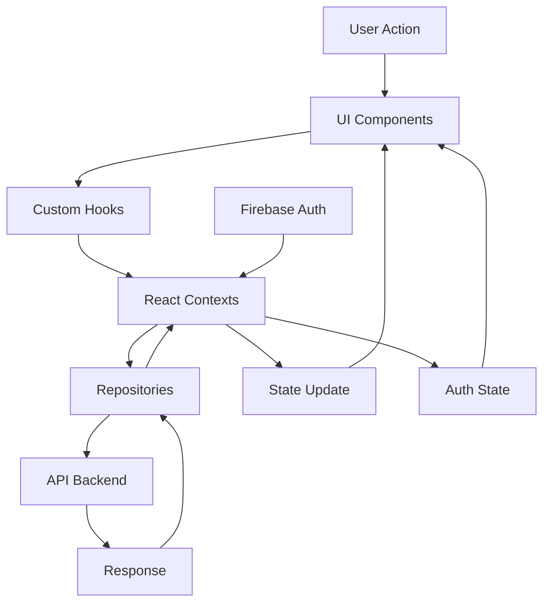

# Architecture Frontend — C2.2.3

## Stack Technologique

Le projet **pfe-web** utilise une stack moderne basée sur :

- **React 18.2** avec TypeScript pour le framework UI
- **Vite 7.0** comme bundler et outil de développement
- **TypeScript 5.2** pour le typage statique
- **Tailwind CSS 3.4** avec DaisyUI pour le styling
- **React Router DOM 6.22** pour le routing SPA
- **Firebase** pour l'authentification
- **Axios 1.6** pour les appels HTTP
- **Vitest** pour les tests unitaires

## Structure du Projet

```
src/
├── applications/           # Modules métier transverses
│   ├── css/               # Styles globaux
│   ├── extensions/        # Extensions et utilitaires
│   └── theme/             # Configuration des thèmes
├── assets/                # Images, fonts, etc.
├── config/                # Configuration (Firebase, etc.)
├── contexts/              # React Contexts pour state global
│   ├── alerts.context.tsx # Gestion des notifications
│   ├── auth.provider.tsx  # Provider d'authentification
│   └── theme.context.tsx  # Gestion du thème (dark/light)
├── data/                  # Types et modèles
│   ├── dto/              # Data Transfer Objects
│   └── models/           # Modèles métier
├── hooks/                 # Custom React hooks
│   ├── useAlerts.ts      # Hook pour les alertes
│   └── useTheme.ts       # Hook pour le thème
├── network/               # Couche réseau
│   ├── authentication/    # Gestion auth Firebase
│   └── repositories/      # Repositories API
├── reducers/              # Reducers pour state management
├── tests/                 # Tests unitaires
├── UI/                    # Composants UI
│   ├── components/        # Composants réutilisables
│   │   ├── alert/        # Composants d'alerte
│   │   ├── buttons/      # Boutons personnalisés
│   │   ├── cards/        # Cartes UI
│   │   ├── common/       # Composants communs
│   │   ├── forms/        # Formulaires
│   │   ├── layout/       # Composants de layout
│   │   ├── modals/       # Modales
│   │   ├── navigation/   # Navigation (NavBar)
│   │   └── tables/       # Tableaux
│   ├── pages/            # Pages de l'application
│   │   ├── authentication/ # Page de login
│   │   ├── cards/        # Gestion des cartes
│   │   ├── dashboard/    # Tableau de bord
│   │   ├── dishes/       # Gestion des plats
│   │   └── settings/     # Paramètres
│   └── style/            # Styles spécifiques UI
├── App.tsx               # Composant racine avec routing
├── main.tsx              # Point d'entrée
└── vite-env.d.ts         # Types Vite
```

## Architecture des Flux



## Patterns Architecturaux

### 1. Repository Pattern
Les repositories dans `src/network/repositories/` encapsulent la logique d'accès aux données :
- `dishes.repository.ts` : Gestion des plats
- `cards.repository.ts` : Gestion des cartes
- `ingredients.repository.ts` : Gestion des ingrédients
- `user.repository.ts` : Gestion des utilisateurs

### 2. Context Pattern
Utilisation de React Context pour l'état global :
- **AuthProvider** : Gestion de l'authentification Firebase
- **AlertsProvider** : Système de notifications centralisé
- **ThemeProvider** : Gestion du thème dark/light

### 3. Custom Hooks
Abstraction de la logique métier :
- `useAlerts()` : Interface pour les notifications
- `useTheme()` : Gestion du thème

### 4. Lazy Loading
Chargement différé des pages avec `React.lazy()` et `Suspense` pour optimiser les performances.

## Conventions de Modules

### Imports
1. Imports externes (React, bibliothèques)
2. Imports de configuration/types
3. Imports de composants
4. Imports de hooks/utils
5. Imports de styles

### Exports
- Export par défaut pour les pages
- Export nommé pour les composants réutilisables
- Export de types depuis `data/dto/` et `data/models/`

## Gestion des Assets

Les assets statiques sont organisés dans :
- `public/` : Fichiers publics accessibles directement
- `src/assets/` : Assets importés dans les modules

## Points d'Extension

Le projet est conçu pour être extensible :
1. Nouveaux repositories dans `network/repositories/`
2. Nouvelles pages dans `UI/pages/`
3. Nouveaux contexts dans `contexts/`
4. Composants réutilisables dans `UI/components/`

## Optimisations Build

La configuration Vite inclut :
- Plugin React SWC pour des builds plus rapides
- Plugin Babel Macros pour twin.macro
- Visualizer pour analyser la taille des bundles
- Tree-shaking automatique en production
