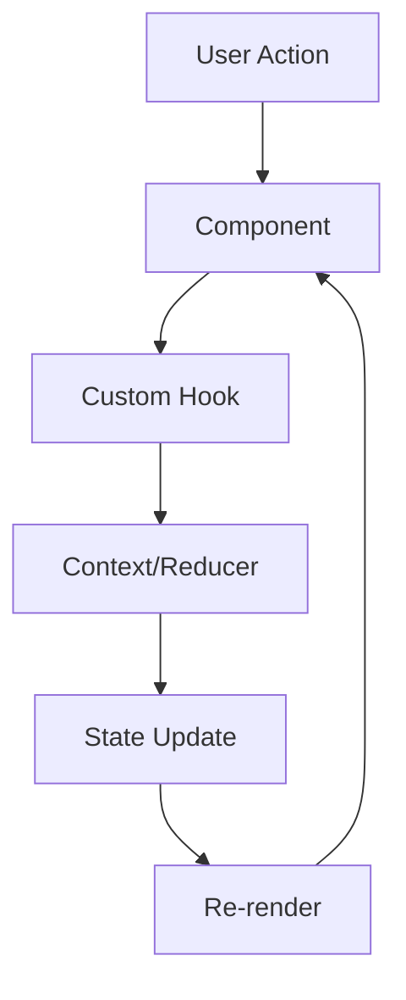

# State Management — C2.2.3

## Architecture de Gestion d'État

Le projet utilise une combinaison de solutions pour la gestion d'état :

1. **React Context API** : État global partagé
2. **useReducer** : Gestion d'état complexe (auth)
3. **État local** : useState pour l'état des composants
4. **Firebase SDK** : État d'authentification

## Contexts Principaux

### 1. AuthProvider Context

Gère l'état d'authentification global :

```typescript
// src/contexts/auth.provider.tsx
const AuthProvider: FC<{ children: ReactNode }> = ({ children }) => {
  const [isLoading, setIsLoading] = useState(true);
  const [isLogin, setIsLogin] = useState(false);
  const [state, dispatch] = useReducer(
    usersListerlocalReducer,
    UsersListerInitialState
  );
  
  // Monitoring Firebase auth state
  useEffect(() => {
    const unsubscribe = firebaseAuthManager.monitorAuthState((user) => {
      setIsLogin(!!user);
      setIsLoading(false);
    });
    
    return () => unsubscribe?.();
  }, []);
  
  return (
    <UsersListerStateContext.Provider value={state}>
      <UsersListerDispatchContext.Provider value={dispatch}>
        {isLogin ? children : <LoginPage />}
      </UsersListerDispatchContext.Provider>
    </UsersListerStateContext.Provider>
  );
};
```

### 2. Alerts Context

Système de notifications centralisé :

```typescript
// src/contexts/alerts.context.tsx
interface AlertsContextType {
  showAlert: (message: string, type: AlertType) => void;
  hideAlert: () => void;
  alerts: Alert[];
}

const AlertsContext = createContext<AlertsContextType | undefined>(undefined);
```

### 3. Theme Context

Gestion du thème dark/light :

```typescript
// src/contexts/theme.context.tsx
interface ThemeContextType {
  isDarkMode: boolean;
  toggleTheme: () => void;
}

const ThemeContext = createContext<ThemeContextType | undefined>(undefined);
```

## Reducers

### Auth Reducer

```typescript
// src/reducers/auth.reducer.ts
type UsersListerAction = 
  | { type: 'UPDATE_USER'; payload: User | undefined }

interface UsersListerLocalState {
  currentUser: User | undefined;
}

export const usersListerlocalReducer = (
  state: UsersListerLocalState, 
  action: UsersListerAction
): UsersListerLocalState => {
  switch (action.type) {
    case 'UPDATE_USER':
      return { ...state, currentUser: action.payload }
    default:
      return state
  }
};
```

## Custom Hooks

### useAlerts

```typescript
// src/hooks/useAlerts.ts
export const useAlerts = () => {
  const context = useContext(AlertsContext);
  if (!context) {
    throw new Error('useAlerts must be used within AlertsProvider');
  }
  return context;
};
```

### useTheme

```typescript
// src/hooks/useTheme.ts
export const useTheme = () => {
  const context = useContext(ThemeContext);
  if (!context) {
    throw new Error('useTheme must be used within ThemeProvider');
  }
  return context;
};
```

### Hooks d'Auth

```typescript
// Hooks pour accéder au state et dispatch
export function useUsersListerStateContext() {
  const context = useContext(UsersListerStateContext);
  if (context === undefined) {
    throw new Error('useStateContext must be used within a MyProvider');
  }
  return context;
}

export function useUsersListerDispatchContext() {
  const context = useContext(UsersListerDispatchContext);
  if (context === undefined) {
    throw new Error('useDispatchContext must be used within a MyProvider');
  }
  return context;
}
```

## Structure de l'État Global

```typescript
// État global de l'application
{
  // Auth State (via reducer)
  auth: {
    currentUser: User | undefined
  },
  
  // Theme State (via context)
  theme: {
    isDarkMode: boolean
  },
  
  // Alerts State (via context)
  alerts: Alert[]
}
```

## Flux de Données

1. **Action utilisateur** → Composant UI
2. **Dispatch action** → Reducer/Context
3. **Mise à jour state** → Re-render
4. **Propagation** → Composants enfants



## Persistance

### État Non Persisté
- État d'authentification : Géré par Firebase
- Alerts : Temporaires par nature
- État UI : Navigation, modals, etc.

### Persistance Future (Planifiée)
```typescript
// Exemple avec localStorage
const persistedState = {
  theme: localStorage.getItem('theme') || 'light',
  userPreferences: JSON.parse(localStorage.getItem('preferences') || '{}')
};
```

## Gestion du Cache

### Cache API Actuel
Pas de solution de cache structurée. Les données sont rechargées à chaque navigation.

### Amélioration Future avec React Query/TanStack Query
```typescript
// Exemple futur
const { data, isLoading, error } = useQuery({
  queryKey: ['dishes'],
  queryFn: fetchDishes,
  staleTime: 5 * 60 * 1000, // 5 minutes
});
```

## Conventions et Bonnes Pratiques

### 1. Organisation des Contexts
```
contexts/
├── auth.provider.tsx     # Provider avec logique
├── alerts.context.tsx    # Context + Provider
├── alerts.types.ts       # Types TypeScript
└── theme.context.tsx     # Context simple
```

### 2. Immutabilité
```typescript
// ✅ Bon - Création d'un nouvel objet
return { ...state, currentUser: action.payload }

// ❌ Mauvais - Mutation directe
state.currentUser = action.payload
return state
```

### 3. Type Safety
- Tous les contexts sont typés
- Actions du reducer typées
- Hooks personnalisés avec types

### 4. Error Boundaries
Recommandé d'ajouter :
```typescript
<ErrorBoundary>
  <AuthProvider>
    <App />
  </AuthProvider>
</ErrorBoundary>
```

## Performance

### Optimisations Actuelles
1. **Lazy loading** des pages
2. **useCallback** pour les handlers
3. **Context splitting** pour éviter re-renders

### Optimisations Futures
1. **useMemo** pour calculs coûteux
2. **React.memo** pour composants purs
3. **Context optimization** avec plusieurs providers

## Tests du State Management

Recommandations :
```typescript
// Test d'un reducer
test('UPDATE_USER action updates the user', () => {
  const initialState = { currentUser: undefined };
  const user = new User(/* ... */);
  
  const newState = usersListerlocalReducer(
    initialState,
    { type: 'UPDATE_USER', payload: user }
  );
  
  expect(newState.currentUser).toBe(user);
});

// Test d'un context
const wrapper = ({ children }) => (
  <AlertsProvider>{children}</AlertsProvider>
);

test('showAlert adds alert to state', () => {
  const { result } = renderHook(() => useAlerts(), { wrapper });
  
  act(() => {
    result.current.showAlert('Test message', 'success');
  });
  
  expect(result.current.alerts).toHaveLength(1);
});
```
